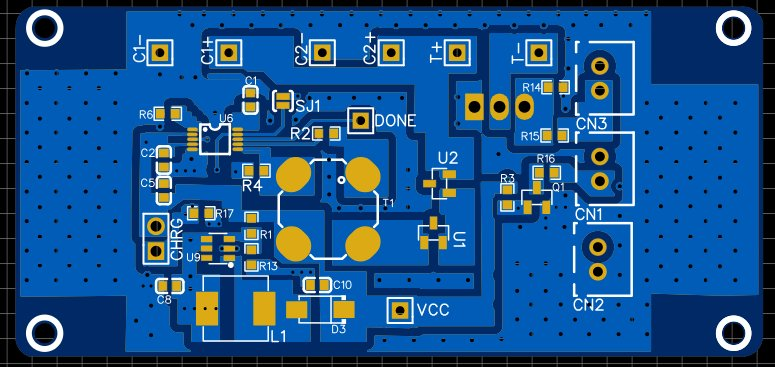
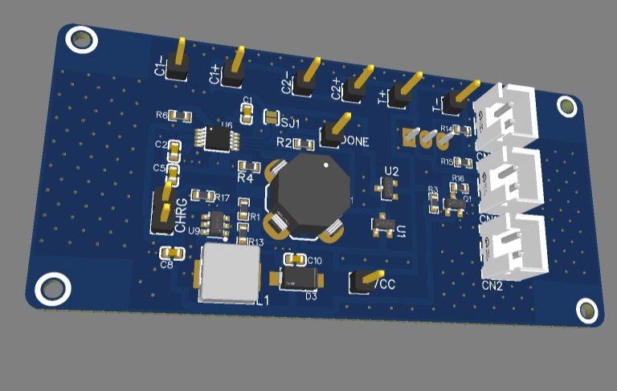

# ⚡ High-Voltage Photoflash Capacitor Charger & Discharger

> **4.5V Alkaline → 450V Photoflash Capacitor · Charge in <30s · Discharge in 0.5s · External Interrupt Trigger**

---

## 📸 PCB

| 2D Layout | 3D Render |
|-----------|-----------|
|  |  |

---

## 🎯 Overview

A compact, self-contained high-voltage capacitor charging and discharge system designed around the **LT3420 photoflash capacitor charger IC**. The system accepts a standard **4.5V alkaline battery** as input and charges one or more photoflash capacitors to **~450V within 30 seconds**. Once fully charged (indicated by the DONE signal), a **push-button external interrupt triggers a controlled discharge** that releases the stored energy in approximately **0.5 seconds** — delivering a high-power, short-duration pulse suitable for strobe, flash, or impulse applications.

---

## 🔧 How It Works

### Stage 1 — Boost & Step-Up
The **MT3608 boost converter** elevates the 4.5V battery input and drives the primary winding of a **PA0367A flyback transformer (1:12 turns ratio)**. The transformer steps the switched primary voltage up to the high-voltage domain on the secondary side.

### Stage 2 — HV Rectification & Capacitor Charging
On the secondary, **dual GSD2004S MOSFETs** (U1, U2) form a rectification and voltage-doubling stage, charging the photoflash capacitor bank (C1, C2 — connected via C1+/C1− and C2+/C2− terminals) up to ~450V. A **SS34 Schottky diode** provides fast rectification with low forward drop.

### Stage 3 — Charge Monitoring (LT3420)
The **LT3420EMS photoflash charger IC** manages the charge cycle intelligently:
- Monitors capacitor voltage via the `VBAT` and `RFB` pins
- Drives the `CHARGE` output to signal active charging
- Asserts `DONE` when the target voltage is reached — halting the boost oscillation and preventing overcharge
- A solder jumper (SJ1) routes the `CHARGE` signal to an LED indicator for visual feedback

### Stage 4 — Discharge Trigger
A **SI2302 N-channel MOSFET (Q1)** sits across the capacitor discharge path. When the `FIRE` signal is received via **CN3 (push button / external interrupt)**, Q1 is switched on through a gate resistor network (R14: 100Ω, R15: 22Ω), discharging the capacitor bank through the load connected at CN1 in approximately **0.5 seconds**.

---

## 📐 Key Specifications

| Parameter | Value |
|-----------|-------|
| Input Voltage | 4.5V (3× AA Alkaline) |
| Output Voltage | ~450V DC |
| Charge Time | < 30 seconds |
| Discharge Time | ~0.5 seconds |
| Transformer Ratio | 1:12 (PA0367A) |
| Boost IC | MT3608 |
| Charger IC | LT3420EMS#PBF |
| Discharge Switch | SI2302 N-MOSFET |
| Trigger | External push button (CN3 FIRE) |
| Charge Indicator | LED via solder-jumper SJ1 |
| Capacitor Terminals | Dual cap bank (C1+/C1−, C2+/C2−) |

---

## 🧩 Key ICs & Components

| Reference | Part | Function |
|-----------|------|----------|
| U6 | LT3420EMS#PBF | Photoflash capacitor charger controller |
| U9 | MT3608 | Boost converter, primary drive |
| T1 | PA0367A (1:12) | Flyback step-up transformer |
| U1, U2 | GSD2004S-V-GS08 | HV MOSFET rectifiers (secondary side) |
| D3 | SS34-YJLTY | Schottky rectifier diode |
| Q1 | SI2302 | Discharge switch MOSFET |
| SJ1 | Solder Jumper | CHARGE LED enable/disable |
| CN1 | 2-pin | Load / LED output |
| CN2 | 2-pin | Battery input |
| CN3 | 2-pin | FIRE trigger (push button) |

---

## ⚠️ Safety Notes

- Output voltage reaches **~450V DC** — lethal if contacted. Handle with appropriate precautions.
- Capacitors retain charge after power removal. Always verify discharge before handling.
- Discharge path must be rated for high peak current pulse (~0.5s burst).
- Gate resistors (R14, R15) are sized to control the discharge dV/dt and protect Q1 from switching stress.

---

## 🗂️ Files

- `assets/pcb_2d.png` — PCB layout (2D)
- `assets/pcb_3d.png` — PCB render (3D)
- Schematic: EasyEDA (EDA tool)
