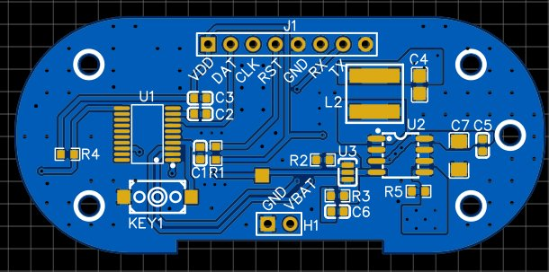
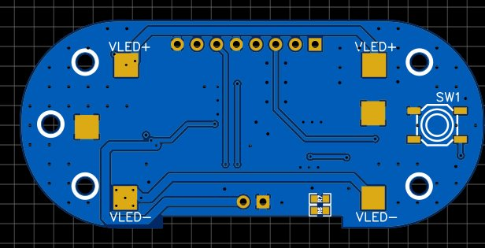
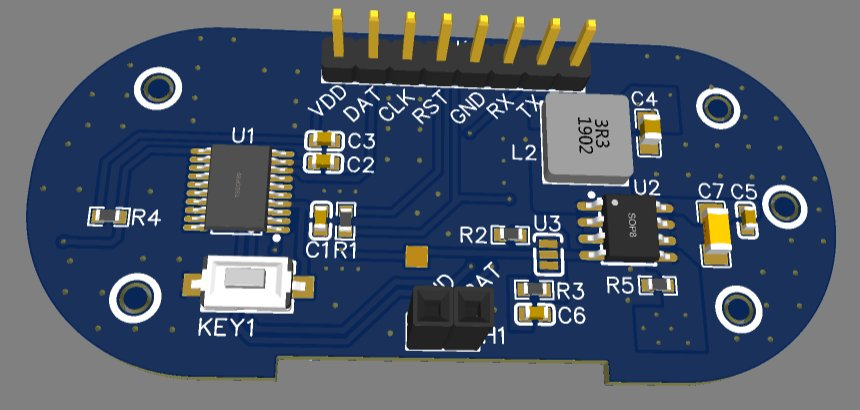

# 💡 Surgical LED Headlamp — Dental & ENT Grade

> **600 Lumens · Fixed 12" Diameter Spot at 2ft · 3-Mode PWM Control · N76E003 MCU + LED2000DR Driver**

---

## 📸 PCB

| Top Layer (Controller + Driver) | Bottom Layer (LED Output) | 3D Render |
|---|---|---|
|  |  |  |

---

## 🎯 Overview

A precision LED headlamp designed specifically for **dental and ENT surgeons**. The optical requirement is strict: **600 lumens delivered as a fixed 12-inch diameter circular spot at a working distance of 2 feet** — matching the typical head-to-patient distance during oral and ENT procedures. The lamp supports **three brightness modes** (High / Medium / Low) cycled via a single push button, allowing surgeons to adapt illumination intensity to the procedure without breaking sterile field awareness.

The board uses a **pill-shaped, compact dual-sided PCB** — controller and driver circuitry on the top layer, high-current LED drive pads with thermal copper pours on the bottom — designed to mount directly to a surgical headband.

---

## 🔧 How It Works

### Controller — N76E003AT20
The **Nuvoton N76E003AT20** (8051-core, 20-pin) serves as the system controller. It generates a **PWM output on the DIM line** to command the LED driver, cycles through brightness modes on each button press, and handles debounce logic. The TICE debug header (J1: VDD, DAT, CLK, RST, GND, RX, TX) allows in-circuit programming and debugging.

### Mode Selection
A **JMP-3-2 jumper (U3)** in combination with a **1kΩ / 4.7kΩ resistor divider** feeds an analog voltage to the DIM input of the LED driver. The MCU controls which resistor combination is active, setting the three distinct PWM duty cycles that correspond to:

| Mode | Output |
|------|--------|
| High | Full 600 lm — full surgical illumination |
| Medium | ~60% — general examination |
| Low | ~25% — reduced glare, patient comfort |

### LED Driver — LED2000DR
The **LED2000DR** is a high-efficiency constant-current LED driver. Key elements:
- **22µH inductor (L2)** — buck converter energy storage
- **50mΩ sense resistor (R5)** — current sensing for closed-loop regulation, ensuring consistent lumen output regardless of battery voltage variation
- **2.2µF (C4) + 10µF (C5/C7)** filtering — smooth, flicker-free output critical in a clinical setting
- **DIM input** — accepts the MCU PWM signal for brightness control
- VLED+ / VLED− output pads on the bottom layer connect directly to the LED module

### Push Button
A **GT-TZ084B SMD tactile switch (SW1)** with a **10kΩ pull-up (R4)** provides the mode-cycle input. Each press steps through High → Medium → Low → High.

---

## 📐 Key Specifications

| Parameter | Value |
|-----------|-------|
| Luminous Output | 600 lumens |
| Beam Diameter | 12 inches (fixed) |
| Working Distance | 2 feet (610 mm) |
| Brightness Modes | 3 (High / Medium / Low) |
| MCU | Nuvoton N76E003AT20 (8051 core) |
| LED Driver | LED2000DR (constant current buck) |
| Inductor | 22µH |
| Current Sense | 50mΩ (R5) |
| Mode Control | PWM via DIM pin |
| Input | VDD (via H1 2-pin connector) |
| Form Factor | Pill-shaped dual-sided PCB |
| Application | Dental / ENT surgical headband |

---

## 🧩 Key Components

| Reference | Part | Function |
|-----------|------|----------|
| U1 | N76E003AT20 | Nuvoton 8051 MCU — PWM & mode control |
| U2 | LED2000DR | Constant-current LED driver (buck) |
| U3 | JMP-3-2_3 | Mode resistor divider selector |
| SW1 | GT-TZ084B-H015-L1 | SMD push button — mode cycle |
| L2 | 22µH | Buck inductor |
| R5 | 50mΩ | LED current sense resistor |
| R4 | 10kΩ | Button pull-up |
| J1 | 8-pin header | TICE debug / programming interface |
| H1 | 2-pin header | Power input (VDD / GND) |

---

## 🏥 Design Considerations for Clinical Use

- **Flicker-free output** — constant-current regulation with adequate output filtering ensures zero visible flicker, preventing eye fatigue during extended procedures
- **Fixed spot geometry** — optical design targets a precisely defined 12" circle at 2ft; no zoom or focus adjustment to fail or drift
- **Single-button UX** — surgeons operate the lamp without looking away from the field; one button, three modes, predictable cycle
- **Compact, lightweight PCB** — pill-shaped form factor minimises headband bulk and balances weight distribution
- **Thermal management** — bottom-layer copper pours around VLED pads conduct heat away from the LED junction

---

## 🗂️ Files

- `assets/pcb_2d_top.png` — Top layer PCB layout (controller + driver)
- `assets/pcb_2d_bottom.png` — Bottom layer PCB layout (LED output pads)
- `assets/pcb_3d.png` — 3D render
- `assets/schematic.pdf` — Full schematic (EasyEDA)
