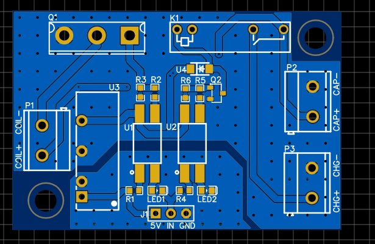
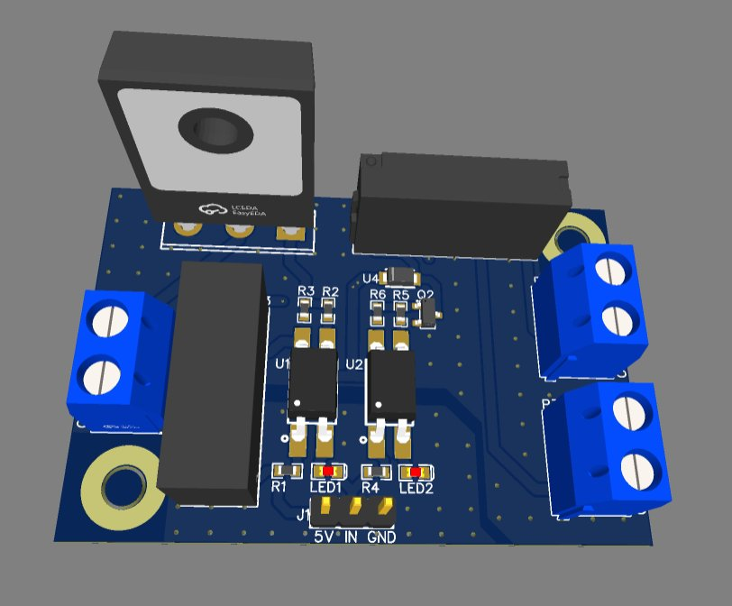

# ⚡ 550V DC Capacitor Charger & Discharger — Arduino Controlled

> **550V DC · Relay-Switched Charging · IRFP460 Low-Side MOSFET Discharge · Galvanically Isolated 5V Logic · Arduino Compatible**

---

## 📸 PCB

| 2D Layout | 3D Render |
|-----------|-----------|
|  |  |

---

## 🎯 Overview

A high-voltage capacitor charge and discharge control board designed to be safely commanded by a standard **5V Arduino** (or any 5V microcontroller). The system charges a capacitor bank to **~550V DC** via a relay-switched charging path and discharges it through a **low-side N-channel MOSFET** switch — all while maintaining **full galvanic isolation** between the Arduino's 5V logic domain and the 550V high-voltage domain.

Two independent optocoupler-isolated control channels handle charge and discharge separately, each with a dedicated LED status indicator, giving the microcontroller complete, safe authority over both operations without any direct electrical connection to the HV rail.

---

## 🔧 How It Works

### Galvanic Isolation — B0505S-2WR3
The foundation of the design's safety architecture is the **B0505S-2WR3 isolated DC-DC converter**. It takes the Arduino's **5V supply** as input and produces an electrically isolated **5V_Iso** output — a completely separate power domain with no common ground to the microcontroller. All HV-side circuitry (optocouplers, relay driver, MOSFET gate) runs on `5V_Iso`, ensuring the Arduino is fully protected from the 550V capacitor voltage under all conditions, including fault events.

### Charge Path — Optocoupler → NPN → Relay (APAN3105)
The **charge control channel** uses:
- **U2 optocoupler** — receives the Arduino's logic signal via a 200Ω current-limiting resistor (R4) with LED2 providing visual confirmation of the command
- **Q2 NPN transistor** — biased via 1kΩ (R5) and 10kΩ (R6) resistor network, drives the relay coil
- **APAN3105 relay (K1)** — switches the high-voltage charging source (connected at P3: CHG+) through to the capacitor terminals (P2: CAP+)

When the Arduino asserts the charge signal, U2 conducts → Q2 saturates → K1 energises → charging current flows into the capacitor bank.

### Discharge Path — Optocoupler → IRFP460BPBF (Low-Side MOSFET)
The **discharge control channel** uses:
- **U1 optocoupler** — receives the Arduino's discharge command via 200Ω resistor (R1), LED1 confirms active state
- **10Ω gate resistor (R2)** — controls the MOSFET turn-on dV/dt to limit inrush and protect the device during high-energy discharge
- **10kΩ gate pull-down (R3)** — ensures the gate is held firmly off when U1 is not conducting, preventing spurious turn-on
- **IRFP460BPBF** — 500V rated, high-current N-channel power MOSFET in TO-247 package, configured as a **low-side switch**: CAP+ → load (coil, P1) → MOSFET drain → source → GND

When the Arduino asserts the discharge signal, U1 conducts → IRFP460 gate charges through R2 → MOSFET turns on → stored capacitor energy discharges through the load at P1 (COIL+/COIL−).

### Control Interface
A **3-pin header (J1: 5V, IN, GND)** provides the Arduino connection point. A single `IN` line distinguishes charge vs. discharge mode, or two separate GPIO lines can be used for independent control of each channel.

---

## 📐 Key Specifications

| Parameter | Value |
|-----------|-------|
| Capacitor Voltage | ~550V DC |
| Logic Input | 5V (Arduino / any MCU) |
| Isolation | Galvanic — B0505S-2WR3 isolated DC-DC |
| Charge Switch | APAN3105 relay (K1) |
| Discharge Switch | IRFP460BPBF N-MOSFET (500V, TO-247) |
| Switch Topology | Low-side (MOSFET source to GND) |
| Gate Resistor | 10Ω (R2) — dV/dt control |
| Gate Pull-down | 10kΩ (R3) — default-off safety |
| Optocouplers | U1 (discharge), U2 (charge) |
| Status Indicators | LED1 (discharge active), LED2 (charge active) |
| Charge Input | P3 — CHG+ |
| Capacitor Terminal | P2 — CAP+ |
| Load Output | P1 — COIL+ / COIL− |
| Control Header | J1 — 3-pin (5V / IN / GND) |

---

## 🧩 Key Components

| Reference | Part | Function |
|-----------|------|----------|
| U3 | B0505S-2WR3 | 5V→5V_Iso isolated DC-DC converter |
| U1 | Optocoupler | Discharge channel isolation |
| U2 | Optocoupler | Charge channel isolation |
| Q1 | IRFP460BPBF | 500V N-MOSFET — low-side discharge switch |
| Q2 | NPN transistor | Relay driver |
| K1 | APAN3105 | HV relay — charge path switching |
| R2 | 10Ω | MOSFET gate resistor (dV/dt limiting) |
| R3 | 10kΩ | Gate pull-down (default-off) |
| R1, R4 | 200Ω | Optocoupler LED current limiters |
| R5 | 1kΩ | Q2 base resistor |
| R6 | 10kΩ | Q2 base pull-down |
| LED1 | LED | Discharge active indicator |
| LED2 | LED | Charge active indicator |
| P1 | 2-pin screw terminal | Coil / load output |
| P2 | 2-pin screw terminal | Capacitor terminals (CAP+) |
| P3 | 2-pin screw terminal | Charge input (CHG+) |
| J1 | 3-pin header | Arduino control interface |

---

## 🛡️ Safety Architecture

| Risk | Mitigation |
|------|-----------|
| MCU exposure to 550V | Full galvanic isolation via B0505S isolated DC-DC + optocouplers on both channels |
| Spurious MOSFET turn-on | 10kΩ gate pull-down (R3) holds gate at GND when optocoupler is off |
| Discharge inrush / MOSFET stress | 10Ω gate resistor (R2) limits turn-on speed and peak current spike |
| Simultaneous charge + discharge | Independent optocoupler channels; firmware enforces mutual exclusion |
| Visual confirmation | Dedicated LEDs on both channels confirm actual switching state |

---

## ⚠️ High Voltage Warning

- Capacitor voltage reaches **~550V DC** — potentially lethal
- Always verify capacitor is fully discharged before handling the board
- Discharge path must be rated for the full peak energy release
- Relay contact ratings must be verified against charging source voltage and current

---

## 🗂️ Files

- `assets/pcb_2d.png` — PCB layout (2D)
- `assets/pcb_3d.png` — PCB render (3D)
- `assets/schematic.pdf` — Full schematic (EasyEDA)
