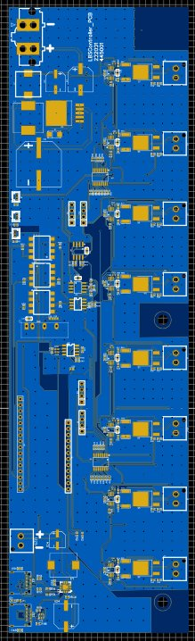
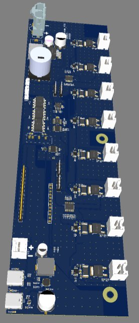

# 🔆 8-Channel DMX/RS485 LED Dimmer Controller with USB-C 100W PD Charging

> **8-Channel PWM LED Dimming · RS485/DMX512 Input · Per-Channel INA226 Current Monitoring · Galvanically Isolated I2C & RS485 · USB-C 100W PD · 24V Rail · ESP HAT Interface**

---

## 📸 PCB

| 2D Layout | 3D Render |
|-----------|-----------|
|  |  |

---

## 🎯 Overview

A professional-grade **8-channel LED dimming controller** designed for architectural and landscape lighting systems (LBS — Lighting Bus System). The board receives **RS485/DMX512 commands**, processes them via an **ESP HAT** connected through an isolated expansion header, and generates independent **PWM signals** to dim 8 LED channels on a **24V rail**. Every channel is individually monitored for current and power via dedicated **INA226 I2C power monitors** — enabling closed-loop feedback, fault detection, and energy metering per channel.

The board also integrates a **USB Type-C 100W Power Delivery** charging circuit, making it a combined lighting controller and device charger in a single compact form factor.

---

## 🔧 Architecture Overview

The design spans 6 schematic sheets covering five functional blocks:

```
RS485/DMX Input ──► Isolated RS485 ──► MCU (N76E003) ──► 8× PWM ──► IPD060N03L MOSFETs ──► LED Channels (24V)
                                            │
                                       INA226 ×8 (I2C) ──► Isolated I2C ──► ESP HAT Header
                                            │
                               USB-C Type-C (×2, 100W PD) ──► XPM52C PD Controller ──► 24V Output
```

---

## 🔧 How It Works

### Block 1 — 8-Channel PWM LED Drive (Sheets 1 & 2)
Two **Nuvoton N76E003AT20** MCUs (U4 and U11) each control 4 channels of PWM output — 8 channels total across the board. Each PWM output drives the gate of an **IPD060N03L-VB N-channel MOSFET** (30V, 60A, low Rds(on)) configured as a low-side switch for the 24V LED load connected via B2P-VH screw connectors (J4–J7, J11–J14).

Gate resistors (47kΩ pull-downs per channel) ensure MOSFETs remain off during power-up before the MCU asserts control, preventing unintended LED flash at startup.

### Block 2 — Per-Channel Power Monitoring (Sheets 1 & 2)
Each of the 8 LED channels has a dedicated **INA226AIDGSR** bidirectional current/power monitor IC. The INA226 measures:
- **Shunt voltage** across a **2mΩ sense resistor** (high-side, per channel) → calculates channel current
- **Bus voltage** (24V rail) → calculates channel power

Each INA226 has a unique **I2C slave address** (programmed via A0/A1 pins: 1000000 through 1001101) allowing all 8 to share a single I2C bus. The ESP HAT reads all 8 channels independently for real-time current monitoring, fault detection, and dimming feedback.

### Block 3 — Galvanic Isolation Layer (Sheet 3)
All communication between the 24V/5V power domain and the ESP HAT's 3.3V domain is fully galvanically isolated:

- **ISO1640BQDRQ1** — automotive-grade I2C digital isolator bridges SDA/SCL between the INA226 I2C bus (`SDA_ISO`/`SCL_ISO`) and the ESP HAT header
- **RFB-0505S** — isolated DC-DC converter generates the isolated `VCC_ISO` supply for the HV-side optocouplers and RS485 driver
- **3× 6N137S high-speed optocouplers** — isolate RS485 TX, RX, and DE/EN lines individually
- **MAX3485EDTR** — 3.3V RS485/DMX transceiver on the isolated side, driving the DMX-A/DMX-B differential pair with 120Ω termination (R105)

### Block 4 — Power Supply (Sheet 1)
The **LM2575S-5.0/NOPB** step-down regulator converts the **24V supply rail to 5V** for the MCUs and logic:
- 330µH inductor (L1) + 330µF + 100µF output capacitors
- **SK34A-LTP** Schottky catch diode
- 100µF input bulk capacitor (C17) for supply stability

### Block 5 — ESP HAT Interface (Sheet 4)
A **16-pin header (J15)** exposes the full control interface to the ESP HAT:
- `485/EN`, `485/RX`, `485/TX` — isolated RS485 control
- `A0`–`A5`, `DATA1`–`DATA3`, `LED-CLOCK` — LED data and clock lines
- `SDA1`, `SCL1` — I2C for INA226 readback
- `3.3V`, `GND`, `RST`

A **12-pin header (J16)** provides additional expansion (VBAT, EN, DATA3).

### Block 6 — USB Type-C 100W Power Delivery (Sheets 5 & 6)
A dual USB-C charging circuit supports **100W PD charging**:
- **2× 12401610E4 USB-C receptacles** (U3, U22) with full pinout — CC1/CC2, DP/DM, VBUS, SuperSpeed lanes
- **TPD4E1U06DCKR** — USB ESD protection array on DP/DM/CC lines
- **XPM52C PD controller (U23)** — USB Power Delivery negotiation IC, takes VBUS input and steps up via a **22µH inductor (L4)** with **220µF + 100µF** output filtering to deliver **24V at the output terminal (U25)**
- CC resistors (2.2Ω per line) set the PD sink/source role
- Charging status LED (16-213/R6C) with 1kΩ current limiter on VBUS

---

## 📐 Key Specifications

| Parameter | Value |
|-----------|-------|
| LED Channels | 8 (independent PWM) |
| LED Supply Voltage | 24V DC |
| MOSFET per Channel | IPD060N03L-VB (30V, 60A, N-ch) |
| Control Protocol | RS485 / DMX512 |
| MCUs | 2× N76E003AT20 (4 ch each) |
| Current Monitoring | 8× INA226AIDGSR (I2C, 2mΩ shunt) |
| I2C Isolation | ISO1640BQDRQ1 (automotive grade) |
| RS485 Isolation | 3× 6N137S optocouplers + MAX3485E |
| Isolated Power | RFB-0505S DC-DC |
| Logic Supply | LM2575S 24V→5V (330µH buck) |
| ESP Interface | 16-pin + 12-pin headers |
| USB-C Ports | 2× (100W PD capable) |
| PD Controller | XPM52C |
| ESD Protection | TPD4E1U06DCKR (DP/DM/CC) |
| RS485 Termination | 120Ω |

---

## 🧩 Key Components

| Reference | Part | Function |
|-----------|------|----------|
| U4, U11 | N76E003AT20 | 8051 MCUs — PWM generation (4 ch each) |
| Q3–Q10 | IPD060N03L-VB | N-MOSFET low-side LED switches |
| U5–U9, U12–U16 | INA226AIDGSR | Per-channel I2C power monitors |
| U17 | ISO1640BQDRQ1 | Automotive I2C digital isolator |
| U18, U20, U21 | 6N137S | High-speed optocouplers (RS485 isolation) |
| U1 | MAX3485EDTR | 3.3V RS485 transceiver |
| U8, U15 | SN65176BDR | 5V RS485/DMX transceivers |
| U10 | LM2575S-5.0 | 24V→5V step-down regulator |
| PWR1 | RFB-0505S | 5V→5V_ISO isolated DC-DC |
| U23 | XPM52C | USB-C PD controller |
| U3, U22 | 12401610E4 | USB Type-C receptacles |
| D2 | TPD4E1U06DCKR | USB ESD protection |
| J15 | 16-pin header | ESP HAT main interface |

---

## 🗂️ Files

- `assets/pcb_2d.png` — PCB layout (2D, tall narrow form factor for rail mounting)
- `assets/pcb_3d.png` — PCB render (3D)
- `assets/schematic.pdf` — Full 6-sheet schematic (EasyEDA)
