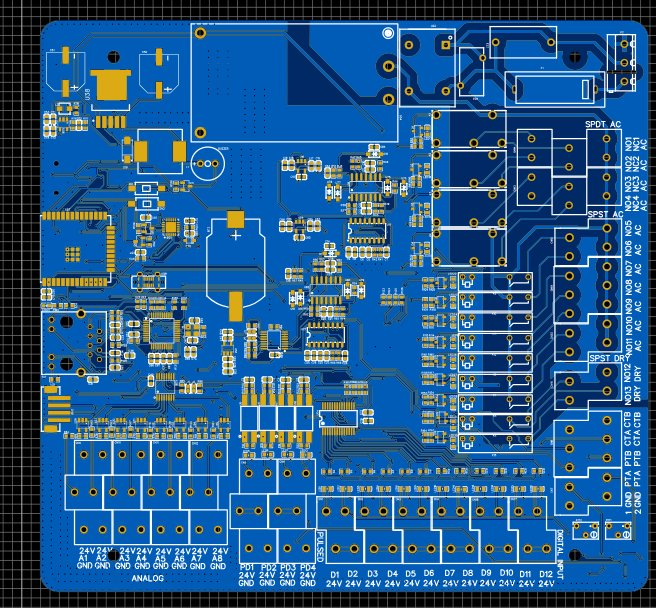
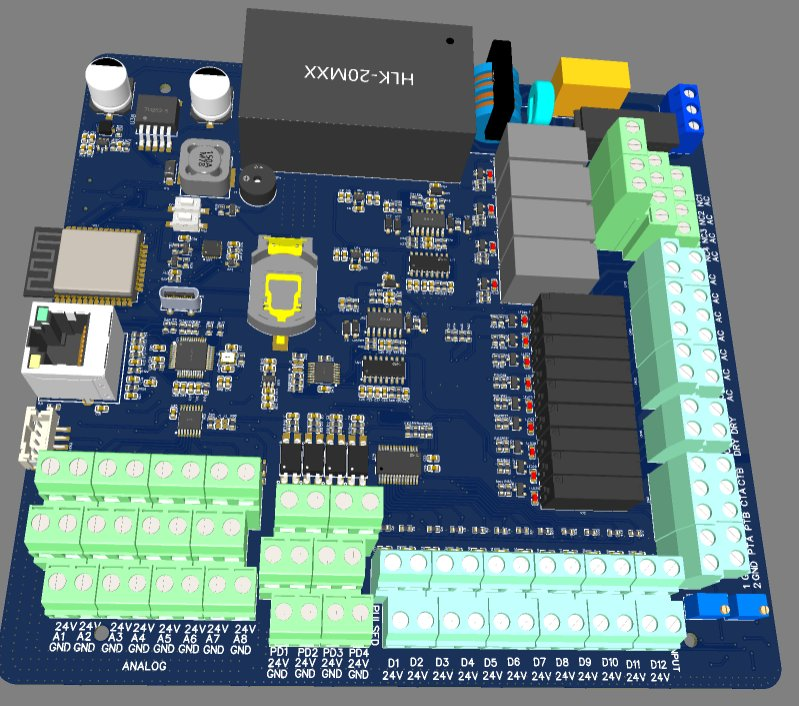

# 💧 Industrial Water Purification Controller — Full Embedded Platform

> **ESP32 · W5500 Ethernet · 12× DI · 4× Pulse DI · 8× 4–20mA Analog · 13× Relays (AC + Dry) · TDS/Conductivity/PT Sensors · HMI · RTC · SD Logging · Web Server**

---

## 📸 PCB

| 2D Layout | 3D Render |
|-----------|-----------|
|  |  |

---

## 🎯 Overview

A complete industrial-grade embedded controller for automated water purification systems. The board hosts a **web server and HMI interface** directly on the ESP32, monitors water quality through **pH, ORP, conductivity, temperature, and TDS sensors**, reads **level switches** across multiple tanks, and drives **13 relay outputs** to control pumps, valves, and purification stage sequencing — all from a single integrated PCB.

Designed for real-world industrial deployment: every field input is optocoupler-isolated, analog inputs use precision 4–20mA current loops with INA196 sense amplifiers, and the board includes Ethernet connectivity, SD card data logging, an RS232 HMI port, and battery-backed RTC for timestamped process records.

---

## 🔧 Architecture — 11 Schematic Sheets

```
AC Mains ──► HLK-20M24 ──► 24V ──► LM2596 ──► 5V ──► SY8089 ──► 3.3V
                                        │
              ┌─────────────────────────┼──────────────────────────┐
              │                         │                          │
    12× DI (Opto)          4× Pulse DI (Opto)         8× 4-20mA Analog
    Level switches          Flow meters               INA196 → ADS7830
              │                         │                          │
              └─────────────────────────┼──────────────────────────┘
                                        ▼
                              ESP32-WROOM-32E (16MB)
                             ┌──────────────────────┐
                             │  Web Server / HMI    │
                             │  MCP23017 ×2 (I2C)  │
                             │  W5500 Ethernet      │
                             │  DS3231 RTC          │
                             │  SD Card (SPI)       │
                             │  CP2102N USB-UART    │
                             │  MAX3232 → HMI       │
                             └──────────┬───────────┘
                                        │
                    ┌───────────────────┼──────────────────┐
                    │                   │                  │
             4× ALQ105 SPST      9× APAN3105       TDS/Cond/PT
             Relays (AC out)     Relays (DRY)      ADS7830 ADC
             Pumps / Valves      Stage control     CD4060 oscillator
```

---

## 🔧 Block-by-Block Description

### Block 1 — Digital Inputs: 12-Channel Level Switch Interface (Sheet 1)
**12 optocoupler-isolated digital inputs** (DIO1–DIO12) accept 24V field signals from level switches, float sensors, and dry contacts across multiple water tanks. Each channel has:
- Optocoupler isolation (24V field → 3.3V logic) with 1kΩ LED current limiter
- 10kΩ pull-up on the output side
- Dedicated status LED per channel for field-visible indication
- 4-pin connectors (CN1–CN4, CN17, CN18) accepting 24V + signal pairs

### Block 2 — Pulse Digital Inputs: 4-Channel Flow Meter Interface (Sheet 2)
**4 optocoupler-isolated pulse inputs** (PDIO1–PDIO4) for high-frequency signals from flow meters and pulse-output sensors. Each channel adds a **0.1µF debounce capacitor** after the optocoupler output to filter contact bounce and noise on long cable runs. Inputs arrive on CN5/CN6 with 24V supply pairs.

### Block 3 — Analog Sensor Front-End: Conductivity, Temperature & TDS (Sheet 3)
The most sophisticated signal conditioning block on the board:

**PT Temperature Sensors (PT01, PT02):**
- Precision op-amp buffers (U8, U14 quad op-amps) with 10kΩ resistor divider networks
- 500Ω output series resistors for driving the ADC
- Output signals PT01_OUT, PT02_OUT → ADS7830 ADC

**TDS / Conductivity Measurement (2 independent channels):**
- **CD4060BM binary counter** (U17, U27) — generates an oscillator signal to drive the conductivity cell AC excitation, preventing electrode polarisation
- **Precision full-wave rectifier** using quad op-amps and **1N4148 signal diodes** — converts the AC conductivity cell response to a clean DC voltage proportional to TDS
- **1N5819HW Schottky diode** on rectifier output for peak detection
- Two independent TDS circuits (TDS Meter1, TDS Meter2) for monitoring two stages simultaneously

**Negative Supply Rail:**
- **2× TPS60400DBVR** — charge-pump inverters generating −3.3V from +3.3V_ADC1, required for the op-amp circuits to accurately buffer signals near ground potential

**ADC:**
- **ADS7830IPWR** — 8-channel, 8-bit I2C ADC reading all analog outputs
- **LP5907MFX-3.3** — ultra-low-noise LDO for the ADC reference supply (+3V3_ADC1), keeping the analog reference clean from digital switching noise
- **INA226** current monitors on the I2C bus for 4–20mA loop monitoring

### Block 4 — 8-Channel 4–20mA Analog Input (Sheet 5)
**8× INA196AIDBVR** precision current-sense amplifiers, one per analog input channel (A1–A8):
- Accepts industry-standard **4–20mA current loop signals** from pH, ORP, dissolved oxygen, and other process transmitters
- 200Ω shunt resistors per channel convert 4–20mA → 0.8V–4V output voltage
- 10Ω series protection resistors on each input
- All 8 outputs multiplex into the **ADS7830 8-ch I2C ADC** (U26)
- I2C address configurable via A0/A1 pins; separate from the conductivity ADC

### Block 5 — Relay Outputs: 4-Channel AC SPST (Sheet 6)
**4× ALQ105 SPST relays** (K1–K4) for direct AC load switching:
- NPN transistor drive (Q1–Q4) via 200Ω base resistors from MCU/GPIO expander
- 10kΩ base pull-downs ensure relays remain off during MCU startup
- NO/NC contacts on each relay brought out to CN13/CN14 terminal blocks
- VAC switched output per channel — controls pumps, solenoid valves, UV sterilisers
- Per-relay LED indicators (LED17–LED20) confirm switching state

### Block 6 — Relay Outputs: 9-Channel 24V Dry Contact (Sheet 10)
**9× APAN3105 relays** (K5–K13) providing additional dry contact outputs (NO5–NO13):
- Same transistor-drive topology (Q5–Q16) with 200Ω/10kΩ drive network
- DRY contact outputs on CN15, CN16, CN19, CN20 — for external stage signalling, PLC interface, or alarm outputs
- Per-relay LED indicators (LED22–LED30)
- **Total relay count: 13 independently controlled outputs**

### Block 7 — Power Supply (Sheet 7)
Three-rail power architecture from AC mains:
- **HLK-20M24** — isolated AC→24V DC module (20W), primary power source; 220nF X-cap input filter, 330µF×2 bulk output capacitance
- **LM2596SX-5.0** — 24V→5V step-down (47µH, SS34LH Schottky)
- **SY8089AAAC** — 5V→3.3V synchronous buck (2.2µH, 10µF), 1% precision feedback resistors (100k/22k) for accurate 3.3V regulation
- **5×20mm fuse holder (F1)** on AC input for overcurrent protection
- Earth ground (EGND) connected to chassis

### Block 8 — MCU & Connectivity (Sheet 8)
The brain of the system:
- **ESP32-WROOM-32E (16MB flash)** — hosts the web server, process logic, sensor polling, and HMI communication
- **CP2102N-A02-GQFN24R** — USB-C to UART bridge for programming and debug
- **2× MCP23017-E/SS** — I2C GPIO expanders providing 32 additional GPIOs (U59, U74) — drives all relay coils and reads DIO signals beyond the ESP32's native IO count
- **MAX3232EESE+** — RS232 level shifter for the **HMI serial interface** (HMI_TX2/RX2)
- **Buzzer** — driven via SS8050-G NPN transistor for process alarms
- USB-C (TYPEC-303-ACP16) for programming/power
- 4-pin JST connector (CN21) for HMI panel: 24V, GND, HMI_RX2, HMI_TX2

### Block 9 — Real-Time Clock (Sheet 9)
- **DS3231MZ+** — temperature-compensated RTC with I2C interface and **coin cell battery backup (BT2)** — maintains accurate time through power cycles for timestamped data logs and scheduled purification cycles

### Block 10 — Ethernet (Sheet 11)
- **W5500** — hardwired TCP/IP Ethernet controller with SPI interface to ESP32 (GPIO13/18/19/23/25/34)
- **HY951180A** — integrated RJ45 with magnetics (transformer isolation, EMI filtering)
- 25MHz crystal (X1) with 18pF load capacitors
- Dedicated AVDD/AGND split for W5500's analog PHY section
- LINK/ACT LEDs driven directly from W5500 status outputs

### Block 11 — SD Card Data Logger (SD Card Sheet)
- **TF-01A** microSD socket via SPI (MOSI/MISO/CLK/CS on GPIO18/19/23 + CS_SDCARD)
- **SP1001-05JTG** TVS diode array — ESD protection on all SPI data lines
- 10µF + 100nF decoupling, 22Ω series resistors for SPI signal integrity

---

## 📐 Key Specifications

| Parameter | Value |
|-----------|-------|
| MCU | ESP32-WROOM-32E (Xtensa LX6, 240MHz, 16MB flash) |
| Connectivity | W5500 Ethernet (TCP/IP) + WiFi (ESP32 native) |
| Digital Inputs | 12× optocoupler-isolated (24V, level switches) |
| Pulse Inputs | 4× optocoupler-isolated (flow meters) |
| 4–20mA Analog Inputs | 8× (INA196 + ADS7830 ADC) |
| Conductivity/TDS | 2× independent (CD4060 oscillator + precision rectifier) |
| Temperature Inputs | 2× PT sensor (op-amp buffered) |
| Relay Outputs (AC) | 4× ALQ105 SPST (NO/NC) |
| Relay Outputs (Dry) | 9× APAN3105 (NO) |
| Total Relay Count | 13 independently controlled |
| GPIO Expansion | 2× MCP23017 (32 additional I/O) |
| RTC | DS3231MZ+ (TCXO, coin cell backup) |
| Data Logging | MicroSD via SPI |
| HMI Interface | RS232 (MAX3232) |
| USB | CP2102N USB-C (programming/debug) |
| Power Input | AC mains (fused) |
| Power Rails | 24V (HLK-20M24) / 5V (LM2596) / 3.3V (SY8089) |
| ADC | 2× ADS7830 (8-ch, 8-bit, I2C) |
| Analog Reference | LP5907 ultra-low-noise 3.3V LDO |
| Negative Rail | 2× TPS60400 (−3.3V for op-amp circuits) |

---

## 🧩 Key ICs

| Reference | Part | Function |
|-----------|------|----------|
| U57 | ESP32-WROOM-32E | Main MCU — server, logic, WiFi |
| U21 | W5500 | Hardwired Ethernet TCP/IP |
| U58 | CP2102N | USB-C to UART (programming) |
| U59, U74 | MCP23017 | I2C GPIO expanders (×2, 32 IO) |
| U73 | MAX3232EESE+ | RS232 for HMI serial port |
| U20 | DS3231MZ+ | Temperature-compensated RTC |
| U26, U37 | ADS7830IPWR | 8-ch I2C ADC (analog inputs) |
| U28–U35 | INA196AIDBVR | 4–20mA current sense amplifiers |
| U36 | LP5907MFX-3.3 | Ultra-low-noise ADC reference LDO |
| U16, U84 | TPS60400DBVR | Charge pump −3.3V generators |
| U17, U27 | CD4060BM | Oscillators for TDS excitation |
| U54 | HLK-20M24 | AC→24V isolated power module |
| U38 | LM2596SX-5.0 | 24V→5V buck regulator |
| U56 | SY8089AAAC | 5V→3.3V synchronous buck |
| K1–K4 | ALQ105 | SPST AC relay outputs |
| K5–K13 | APAN3105 | 24V dry contact relay outputs |
| CARD1 | TF-01A | MicroSD socket (SPI) |
| RJ1 | HY951180A | RJ45 with integrated magnetics |

---

## 🗂️ Files

- `assets/pcb_2d.png` — PCB layout (2D)
- `assets/pcb_3d.png` — PCB render (3D) — HLK module, RJ45, relay bank, and full terminal block array visible
- `assets/schematic.pdf` — Full 11-sheet schematic (EasyEDA)
