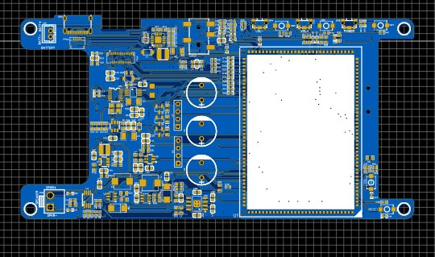
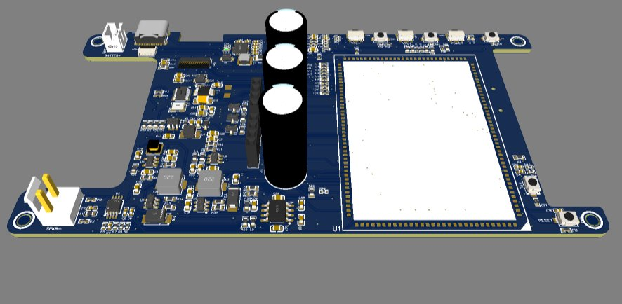

# 📱 Custom A133 SOM Carrier Board — Yoga & Wellness Tablet

> **Allwinner A133 · Quad-core ARM Cortex-A53 · 4-Lane MIPI-DSI · Li-Ion BMS · Dual Boost (13V/22V) · USB Hub · Audio Amp · TRRS Jack · Touch Panel · 10-Sheet Design**

---

## 📸 PCB

| 2D Layout | 3D Render |
|-----------|-----------|
|  |  |

---

## 🎯 Overview

A full custom carrier board for the **Allwinner A133 System-on-Module** — a quad-core ARM Cortex-A53 application processor running Android or Linux. Designed as the hardware foundation for a **yoga and wellness monitoring tablet**, the board integrates every peripheral required for a standalone mobile device: display, touch, audio, battery management, USB hub, multi-button input, and software-controlled power switching — all on a single custom PCB.

The design required managing **high-speed MIPI-DSI differential lanes**, **USB 2.0 signal integrity**, **Li-ion battery charging and multi-rail power generation**, and **full ESD protection** on every external interface — a complete mobile device hardware stack built from scratch.

---

## 🔧 Architecture — 10 Schematic Sheets

```
Li-Ion Battery (VBAT)
        │
        ├──► TP5100 Charger ◄── USB-C (VBUS)
        │
        ├──► SM8103EADC Buck ──► 3.3V (VCC-3V3) ──► A133 SOM / Logic
        │
        ├──► MP2307DN Buck ──► 5V ──► USB Hub / CH340E / Peripherals
        │
        ├──► MT3608 Boost ──► 13V ──┐
        │                            ├──► Display Backlight / PA Supply
        ├──► MT3608 Boost ──► 22V ──┘
        │
        └──► SI2301/SI2302 Switches ──► GPIO-controlled power domains
                                              │
                        ┌─────────────────────┼──────────────────────┐
                        │                     │                      │
              A133 SOM (U1)           4-Lane MIPI-DSI          USB Type-C
              144-pin QFN         FH35C-25S FPC (27-pin)      CH340E + SL2.1S Hub
                  │                   + Touch FPC (6-pin)
                  │
        ┌─────────┼──────────┐
        │         │          │
   LRADC ADC   Audio I/O   SDC0 MicroSD
   6-button   LPA4890 Amp   ESD array
   ladder     PJ-327F TRRS  (8× KAU0511)
```

---

## 🔧 Block-by-Block Description

### Block 1 — Allwinner A133 SOM (Sheet 1)
The **A133** is a quad-core ARM Cortex-A53 @ up to 1.6GHz application processor with integrated Mali-G31 GPU, targeting Android and Linux applications. On this carrier board, the SOM interfaces through a 144-pin QFN pad array exposing:
- **4-lane MIPI-DSI** (PD0–PD9: D0P/D0N, D1P/D1N, D2P/D2N, D3P/D3N + clock pair) for the display
- **SDC0** (6-wire: CLK, CMD, D0–D3 + DET) for the microSD
- **USB0** (DP/DM) — upstream USB, routed through the hub
- **UART0** (TX/RX) — debug/programming via CH340E
- **Audio** — LINEOUTP/LINEOUTN (differential line out), MICIN2P/N (differential mic), HPOUTR/L, HPOUTFB, HP-DET, HBIAS
- **LRADC** — single-wire resistor-ladder ADC input for 6-button decoding
- **PWRON** — power-on button input
- **FEL** — Allwinner FEL (USB boot) mode control
- **GPIO1, GPIO2** — control power switches (SI2301/SI2302 MOSFETs)
- **AVCC, VDD50V** — analog and I/O supply rails

### Block 2 — Battery Power System (Sheet 6)
A multi-rail power architecture generates all required voltages from a single Li-ion cell:

**Battery Charging — TP5100:**
- 2A synchronous Li-ion/LiPo charger accepting **VBUS** from USB-C
- **22µH inductor** + **50mΩ current sense resistor** for precise charge current regulation
- **1N5819HW Schottky** on output path
- CHRG/STDBY LED status indicators
- Separate VREG output with 10µF + 100nF decoupling

**Dual Boost Converters — 2× MT3608:**
- **MT3608 #1 → +13V** (22µH L3, 22µF output, 100k/4.7k feedback) — powers the audio PA and intermediate rail
- **MT3608 #2 → +22V** (22µH L2, 22µF output, 100k/2.8k feedback) — drives LCD backlight boost stage
- **3× 1000µF bulk capacitors** on the +13V output bus for audio transient headroom

**Buck Converter — MP2307DN (VBAT→5V):**
- Synchronous 3A buck: **10µH L9**, 22µF output, precision feedback (44.2k/6.8k) for accurate 5V regulation
- Soft-start (3.9nF), compensation network (100nF + 10k) for stability across battery voltage range

**Power Switches — SI2301CDS (P-ch) + SI2302 (N-ch):**
- GPIO1 and GPIO2 from the A133 control P-channel and N-channel MOSFETs respectively — enabling software-controlled power sequencing and domain switching, critical for proper SOM boot and suspend behaviour

### Block 3 — Main Buck Regulator: VBAT→3.3V (Sheet 2)
**SM8103EADC** — synchronous step-down converter:
- **4.7µH inductor**, 10µF×2 output, 100pF compensation
- Feedback resistors: 100k / 22.1k — sets exact 3.3V output
- 10µF input decoupling on VBAT
- VCC-3V3 nets power the A133 SOM, SD card pull-ups, and logic peripherals

### Block 4 — MIPI-DSI Display Interface (Sheets 7 & 10)
**FH35C-25S-0.3SHW** — 27-pin, 0.3mm pitch FPC connector carrying:
- 4-lane MIPI-DSI (differential pairs D0–D3 + clock)
- AVDD2.8V display logic supply
- LED_A+ / LED_K− backlight drive
- LCD-RST via 10kΩ pull-up and 10µF decoupling

**Backlight driver (U3, Sheet 7):** Boost converter topology (10µH, 1N5819WS, LCD-PWM dimming input) generating the LED string drive voltage, controlled via A133 PWM output for software brightness adjustment.

**AVDD2.8V generation (SY8089A1AAC):** Synchronous buck from 5V → 2.8V (4.7µH, 365k/100k feedback) for display logic supply. LCD-EN GPIO controls the enable pin.

**ESD protection (Sheet 10):** **15× KAU0511P1** Schottky ESD diodes — one per signal — on every MIPI-DSI lane (D0P/N through D3P/N, CK P/N), TP-INT/SCK/SDA/RST, and LCD-RST. Essential for protecting the high-speed differential interface from electrostatic discharge during assembly and field handling.

### Block 5 — Touch Panel Interface (Sheet 7)
**KH-0.5-H3.25-6PIN FPC** — 6-pin, 0.5mm pitch connector for the capacitive touch controller:
- I2C bus: TP-SCK, TP-SDA with 4.7kΩ pull-ups to VCC-3V3
- TP-INT (interrupt), TP-RST (reset) with 4.7kΩ pull-ups
- AVDD2.8V power supply to the touch IC

### Block 6 — Audio System (Sheets 4 & 5)

**Speaker Amplifier — LPA4890MSF (Sheet 4):**
- Stereo BTL audio power amplifier, input from A133 LINEOUTP/LINEOUTN differential outputs
- **600Ω ferrite bead (L1)** on VDD50V supply — isolates switching noise from the analog PA supply rail
- 20kΩ/33kΩ gain resistors set amplifier gain
- 220nF AC-coupling, 100nF bypass
- PA-SHDN controlled by A133 GPIO for low-power muting
- SPKR+/− output on B2P-VH screw connector, ESD on both lines

**TRRS Headphone/Mic Jack — PJ-327F (Sheet 5):**
- Standard 3.5mm TRRS jack wired to CTIA standard (RA1=mic, RA2=0Ω, RN1, RN2=NC)
- HPOUTL/R stereo headphone output with 1µF AC-coupling capacitors
- **HP-DET** plug detection → A133 MIC_DET interrupt
- **HBIAS** microphone bias supply with 2kΩ + 2.2µF filtering
- **5× KAU0511P1** ESD protection on all TRRS lines
- MICIN2P/N differential mic input with 100nF + 33pF RF filtering

### Block 7 — MicroSD Card (Sheet 3)
**TF1 microSD socket** wired to SDC0 bus (4-bit: CLK, CMD, D0–D3, DET):
- **8× KAU0511P1 ESD diodes** — one per data line — protecting all SDC0 signals
- 10kΩ pull-ups on CMD and D lines to VCC-3V3
- 10µF + 100nF supply decoupling on the card VDD pin

### Block 8 — USB Interface (Sheet 9)
**USB Type-C Receptacle** (16-pin, TYPE-C 16PIN 2MD):
- VBUS, DP1/DN1, DP2/DN2, CC1/CC2 — full USB-C pinout
- **3× KAU0511P1** ESD protection on USB data lines

**SL2.1S USB 2.0 Hub:**
- Splits the A133 USB0 upstream port into downstream ports
- HUB1-DP3/DM3 routed to the CH340E UART bridge
- Crystal oscillator (C9002) for hub PLL reference
- 4.7µF + 10µF + 100nF supply decoupling

**CH340E USB-UART Bridge:**
- Connects UART0-TX/RX to the USB hub downstream port for programming and serial debug
- 1N5819HW diode on RX line for level protection
- 10µF + 100nF decoupling

### Block 9 — Multi-Button Input (Sheet 8)
**LRADC Resistor Ladder — 6 Buttons:**
A single A133 LRADC (Low-Resolution ADC) pin decodes 6 physical buttons through a precision resistor voltage divider:

| Button | Resistors | Decoded Voltage |
|--------|-----------|-----------------|
| SW3 | 100k / 6.8k | ~0.19V |
| SW4 | 100k / 8.2k | ~0.23V |
| SW5 | 100k / 10k | ~0.27V |
| SW6 | 100k / 11k | ~0.30V |
| SW7 | 100k / 13k | ~0.34V |
| SW8 | PWRON | Power-on event |

1nF anti-alias capacitor on the LRADC line filters switch bounce. This technique allows up to 6 physical buttons on a single ADC pin — ideal for a tablet form factor where GPIO count is limited.

**AP-RESET** (SW2 + KAU0511P1): Hardware reset to the A133 RESET pin with ESD protection.
**PWRON** (SW8 + 1TS003A): Long-press power button to the A133 PWRON input.

---

## 📐 Key Specifications

| Parameter | Value |
|-----------|-------|
| Application Processor | Allwinner A133 (Quad-core ARM Cortex-A53, Mali-G31 GPU) |
| OS Support | Android / Linux |
| Display Interface | 4-lane MIPI-DSI (FH35C-25S 27-pin FPC, 0.3mm pitch) |
| Touch Interface | I2C capacitive (KH-0.5 6-pin FPC) |
| Audio Out | LPA4890MSF BTL stereo amplifier + 3.5mm TRRS headphone |
| Audio In | Differential MICIN + TRRS headset mic (HBIAS) |
| Battery | Li-ion (B2B-PH-K connector) |
| Charger | TP5100 (2A, USB-C VBUS input) |
| Boost Rails | +13V (MT3608) / +22V (MT3608) |
| Main Buck | SM8103EADC (VBAT→3.3V) |
| 5V Buck | MP2307DN (VBAT→5V, 3A) |
| Display Supply | SY8089A1AAC (5V→AVDD2.8V) |
| Storage | MicroSD via SDC0 (TF1 socket) |
| USB | Type-C + SL2.1S hub + CH340E UART |
| Buttons | 6× LRADC ladder + PWRON + AP-RESET |
| ESD Protection | KAU0511P1 on all high-speed interfaces (35+ diodes) |
| Power Switches | SI2301CDS (P-ch) + SI2302 (N-ch), GPIO-controlled |

---

## 🧩 Key Components

| Reference | Part | Function |
|-----------|------|----------|
| U1 | Allwinner A133 SOM | Quad-core A53 application processor |
| U8 | TP5100 | 2A Li-ion battery charger |
| U9 | SM8103EADC | VBAT→3.3V synchronous buck |
| U14 | MP2307DN | VBAT→5V synchronous buck (3A) |
| U2, U5 | MT3608 | Boost converters (+13V, +22V) |
| U10 | SY8089A1AAC | 5V→AVDD2.8V buck for display |
| U3 | LED boost driver | Backlight boost (LCD-PWM) |
| U4 | LPA4890MSF | Stereo BTL speaker amplifier |
| Q2 | SI2301CDS | P-ch MOSFET power switch |
| Q4, Q5 | SI2302 | N-ch MOSFET power switches |
| FPC1 | FH35C-25S-0.3SHW | 27-pin 0.3mm MIPI-DSI display FPC |
| FPC2 | KH-0.5-H3.25-6PIN | 6-pin touch panel FPC |
| AUDIO1 | PJ-327F | 3.5mm TRRS audio jack |
| TF1 | MicroSD socket | SDC0 storage |
| USB1 | TYPE-C 16PIN 2MD | USB-C receptacle |
| U11 | CH340E | USB-UART bridge (UART0 debug) |
| U12 | SL2.1S | USB 2.0 hub |
| D2–D42 | KAU0511P1 | ESD protection diodes (35+) |
| SW1 | SKRKAEE020 | FEL boot button |
| SW2 | SKRKAEE020 | AP-RESET |

---

## 🗂️ Files

- `assets/pcb_2d.png` — PCB layout (2D) — A133 SOM footprint, bulk capacitors, and FPC connectors visible
- `assets/pcb_3d.png` — PCB render (3D) — SOM keep-out zone, large bulk caps, USB-C and FPC connectors
- `assets/schematic.pdf` — Full 10-sheet schematic (EasyEDA)
