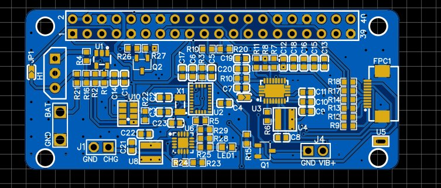
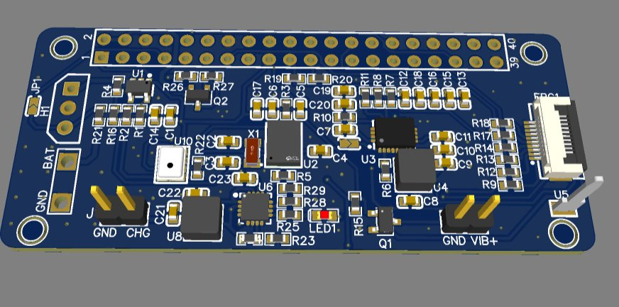

# 🤿 Underwater Diver Data Logger & Camera HAT — Radxa Zero

> **Radxa Zero HAT · MS5837 Depth/Pressure · BNO085 9-DOF IMU · I2S MEMS Mic · USB Camera · TPS61088 10A Boost · Li-Ion BMS · 6-LED FPC Panel · Vibration Alert · Hall Sensor · CSV Logging**

---

## 📸 PCB

| 2D Layout | 3D Render |
|-----------|-----------|
|  |  |

---

## 🎯 Overview

A custom **HAT (Hardware Attached on Top)** for the **Radxa Zero** single-board computer, purpose-built for underwater diver monitoring. The system simultaneously records **depth and pressure** via a waterproof MS5837 sensor, logs **9-DOF inertial motion data** from a BNO085 IMU, captures **underwater video** via a USB camera, and records **ambient audio** through a MEMS digital microphone — all timestamped and written to CSV/file on the Radxa Zero.

Designed to fit inside a sealed, pressure-rated housing, the HAT integrates battery management, a high-current boost converter to power the camera and wireless module, vibration motor alerts for the diver, and a 6-LED FPC indicator panel — a complete self-contained dive computer platform.

---

## 🔧 Architecture

```
Li-Ion Battery (VBAT)
        │
        ├──► ETA6003Q3Q Charger ◄── +5VWIRELESS (USB input)
        │         │
        │        SYS ──► TPS61088 10A Boost ──► VOUT (Camera / Wireless)
        │
        └──► SI2301 P-ch Switch ──► +5VWIRELESS (EN-controlled)

Radxa Zero v1.51+ (40-pin HAT header)
        │
        ├── I2C ──► MS5837 Pressure/Depth Sensor (U1, AIN)
        │       └──► BNO085 9-DOF IMU (U2, I2C + 32.768kHz RTC crystal)
        │
        ├── I2S ──► MSM261S4030H0R MEMS Microphone (U10)
        │
        ├── GPIO ──► Vibration Motor (Q1 NPN)
        │        ──► A3144 Hall Effect Sensor (H1)
        │        ──► LED1–LED6 (via FPC1 12-pin panel)
        │
        ├── SARADC ──► VBAT/2 divider (battery voltage monitor)
        │
        └── USB ──► USB Camera (video recording)
```

---

## 🔧 Block-by-Block Description

### Block 1 — Radxa Zero HAT Interface (Sheet 1)
The **Radxa Zero v1.51+** (U7) connects via a standard **40-pin HAT header** (pins 1–40), providing:
- **I2C** (I2C_EE_M3_SDA/SCL, pins 3/5) → BNO085 IMU and MS5837 pressure sensor
- **I2S** (I2S_SCLK / I2S_LRCLK / I2S_SD, pins 12/13/38) → MEMS microphone
- **VIBRATION** GPIO (pin 18) → vibration motor transistor drive
- **LED1–LED6** GPIOs (GPIOH_4/5, GPIOC_7/H_6, GPIOAO_2, SARADC_CH2) → 6-LED FPC panel
- **CHG_SENS** (GPIOH_5) → battery charging status from ETA6003
- **EN** (GPIOAO_3) → SI2301 wireless power switch control
- **SARADC_CH1** → VBAT/2 voltage divider for battery state monitoring
- **+3V3** and **+5V** rails sourced from Radxa Zero's onboard regulators
- **UART0** (GPIOAO_0/1) available on debug header

### Block 2 — Depth & Pressure Sensor: MS5837 (Sheet 1, U1)
The **MS5837** is a precision waterproof pressure sensor rated to 300m depth, communicating over **I2C** (SCL/SDA with 10kΩ pull-ups to +3V3). In this circuit:
- VDD/VSS powered from +3V3 with 100nF decoupling
- **AIN pin** used as a secondary ADC input — routed back to the Radxa Zero's SARADC for additional analog measurement
- The **VBAT/2 resistor divider** (2× 100kΩ, R4/R16) on the AIN path allows battery voltage monitoring through the same ADC channel, keeping GPIO count efficient
- Depth calculated from pressure differential in firmware; data logged to CSV with timestamp

### Block 3 — 9-DOF IMU: BNO085 (Sheet 1, U2)
The **BNO085** is a high-performance sensor fusion IMU integrating:
- 3-axis accelerometer + 3-axis gyroscope + 3-axis magnetometer
- Integrated **ARM Cortex-M0+ sensor hub** running Hillcrest Labs CEVA SH-2 firmware — outputs calibrated rotation vectors, linear acceleration, gravity vectors directly over I2C
- **32.768kHz crystal (X1)** with 22pF load capacitors provides the real-time clock reference for sensor timestamp accuracy
- PS1/PS0 pins configure the I2C interface mode
- BOOTN and NRST controlled by Radxa GPIO for hard-reset capability
- 100nF decoupling (C4, C5, C6) on VDD and VDDIO
- All dive motion data (orientation, depth, acceleration) combined in firmware for a complete dive profile

### Block 4 — I2S MEMS Microphone: MSM261S4030H0R (Sheet 2, U10)
A **digital MEMS microphone** with I2S output — ideal for underwater acoustic capture in a sealed housing:
- **I2S_SCK** (bit clock), **I2S_LRCLK** (word select / L-R channel), **I2S_SD** (serial data) — all routed directly to Radxa Zero I2S interface
- **100kΩ pull-up (R22)** on SD line — holds the line defined between I2S frames
- **CHIPEN** pin pulled to +3V3 (enabled by default)
- **L/R pin** sets channel assignment (left = GND)
- Power supply: **47µF (C17) + 10µF (C1) + 0.1µF (C14)** — three-stage decoupling for clean mic supply, suppressing switching noise from the boost converter

### Block 5 — Hall Effect Sensor: A3144 (Sheet 1, H1)
The **A3144 Hall effect sensor** (TO-220AB package) detects magnetic field presence — used for:
- Reed-switch-style **housing seal detection** (magnet on lid triggers sensor when housing is sealed/opened)
- Or **rotation counting** for propeller/thruster RPM measurement
- VCC from VBAT, open-collector output with 10kΩ pull-up to +3V3, direct GPIO input to Radxa Zero

### Block 6 — 6-LED Indicator Panel via FPC (Sheet 2, FPC1)
**FPC-05F-10PH20** — 12-pin, 0.5mm pitch FPC connector carrying:
- **LED1–LED6** — 6 indicator LEDs each with **1kΩ current-limiting resistors** (R9, R12–R15, R17, R18)
- **SDA, SCL** — I2C bus for any addressable LED controller on the panel board
- **+3V3, GND** — panel power supply
- Each LED driven by a dedicated Radxa GPIO, giving the diver visual indication of: depth zone, recording status, battery level, sensor fault, etc.

### Block 7 — Vibration Motor Alert (Sheet 2)
**NPN transistor (Q1)** + **1kΩ base resistor (R15)**:
- VIBRATION GPIO from Radxa Zero switches Q1 on/off
- Motor draws current from **VBAT** through the collector
- Provides tactile alerts to the diver (depth limit warning, recording start/stop, low battery) — critical in underwater environments where audio alerts are impractical

### Block 8 — Power System (Sheet 3)

**Li-Ion Charger — ETA6003Q3Q (U6):**
- Synchronous Li-ion charger accepting **+5VWIRELESS** (USB/external) as input
- **SYS** output = battery-managed system rail (powers the boost and Radxa Zero)
- **ISET1 (2kΩ) / ISET2 (500Ω)** resistors set the charge current profile
- **STAT** output drives **LED1** (1kΩ) for charge status indication
- **USB_DET** with 10kΩ/10kΩ divider for USB detection
- 22µF input (C23) and 22µH inductor (U8) + 22µF output (C22) for clean switching

**High-Current Boost — TPS61088QRHLTQ1 (U3):**
- **Automotive-grade 10A synchronous boost converter** — takes SYS rail and boosts to VOUT for USB camera and wireless module power
- **2.2µH power inductor (U4)** handles up to 10A peak switching current
- **5× 22µF output capacitors** (C12, C13, C15, C16) + 1µF (C18) — 111µF total output capacitance for camera inrush current stability
- Feedback: **360k / 110k (R7/R8)** setting VOUT, **17.4kΩ (R11)** sets current limit, **240kΩ (R6)** sets switching frequency
- **47nF soft-start (C11)** controls output ramp-up rate to prevent inrush from crashing the battery
- **MODE pin** selects PWM/PFM for efficiency optimization

**Wireless Power Switch — SI2301CDS P-ch MOSFET (Q2):**
- **EN GPIO** from Radxa Zero drives gate via **10Ω (R26)** + **10kΩ (R27)** gate network
- Switches +5V to the wireless module domain (+5VWIRELESS) — allows software-controlled power cycling of the wireless module to save battery during dive (WiFi off underwater, on at surface for data upload)

---

## 📐 Key Specifications

| Parameter | Value |
|-----------|-------|
| Host Platform | Radxa Zero v1.51+ (Amlogic S905Y2, 40-pin HAT) |
| Pressure Sensor | MS5837 (I2C, 0–300m rated) |
| IMU | BNO085 (9-DOF, integrated fusion, I2C) |
| Crystal | 32.768kHz (22pF, IMU RTC reference) |
| Microphone | MSM261S4030H0R (I2S digital MEMS) |
| Hall Sensor | A3144 (magnetic flux, TO-220AB) |
| Video | USB camera (via Radxa Zero USB port) |
| LED Panel | 6× LEDs via FPC-05F-10PH20 (12-pin, 0.5mm) |
| Vibration | NPN motor driver (VBAT powered) |
| Charger | ETA6003Q3Q (Li-Ion, USB input) |
| Boost Converter | TPS61088QRHLTQ1 (10A, automotive grade) |
| Boost Inductor | 2.2µH |
| Boost Output Caps | 111µF total (5× 22µF + 1µF) |
| Wireless Switch | SI2301CDS P-ch MOSFET (EN-controlled) |
| Battery Monitor | VBAT/2 divider → SARADC_CH1 |
| Data Output | CSV log (pressure, IMU, timestamp) |
| Form Factor | HAT (Radxa Zero compatible) |

---

## 🧩 Key Components

| Reference | Part | Function |
|-----------|------|----------|
| U7 | Radxa Zero v1.51+ | Host SBC — Linux, USB camera, data logging |
| U1 | MS5837 (via I2C ADC) | Depth / pressure sensing |
| U2 | BNO085 | 9-DOF IMU with sensor fusion |
| X1 | 32.768kHz crystal | IMU RTC / timestamp reference |
| U10 | MSM261S4030H0R | I2S digital MEMS microphone |
| H1 | A3144 | Hall effect / magnetic field sensor |
| U3 | TPS61088QRHLTQ1 | 10A automotive boost converter |
| U6 | ETA6003Q3Q | Li-Ion battery charger |
| Q2 | SI2301CDS | P-ch MOSFET wireless power switch |
| Q1 | NPN transistor | Vibration motor driver |
| FPC1 | FPC-05F-10PH20 | 12-pin 6-LED indicator panel |
| J4 | 2-pin header | Vibration motor connector |
| J1, J2 | 2-pin headers | +5VWIRELESS / VBAT breakout |

---

## 🗂️ Files

- `assets/pcb_2d.png` — PCB layout (2D) — 40-pin HAT header, BNO085, boost converter, FPC connector visible
- `assets/pcb_3d.png` — PCB render (3D) — compact HAT form factor, BNO085 crystal, charging IC clearly visible
- `assets/schematic.pdf` — Full 3-sheet schematic (EasyEDA)
