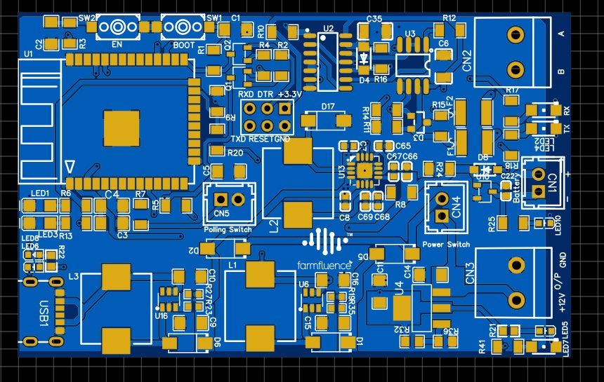
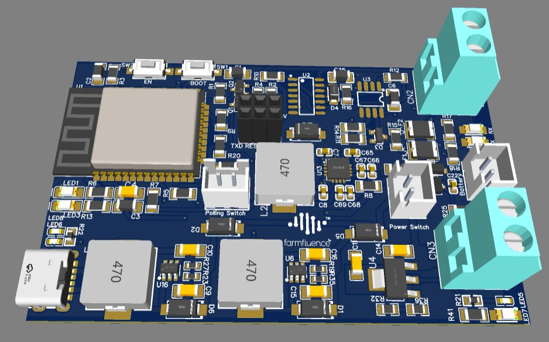

# 🌱 BLE Soil Sensor — Wireless IoT Field Node with RS485 & MQTT

> **ESP32 BLE/WiFi · RS485 Isolated Network · MQTT Telemetry · TP5100 Li-Ion BMS · Dual MT3608 Boost (5V→12V) · LM317 3.3V · Battery + USB-C · 4-Sheet Design**

---

## 📸 PCB

| 2D Layout | 3D Render |
|-----------|-----------|
|  |  |

---

## 🎯 Overview

A wireless IoT field sensor node designed for agricultural soil monitoring. The board reads soil sensor data over a **RS485 bus** (Modbus or proprietary protocol), processes it on an **ESP32**, and publishes telemetry to a remote server via **MQTT over WiFi/BLE**. Designed for outdoor, battery-powered field deployment with **USB-C charging**, a dual-boost power architecture that generates 12V from both USB and battery for powering RS485 field sensors, and a robust RS485 front-end with ESD protection and polyfuse safety.

Developed at **Augmatic Technologies Pvt Ltd** for agricultural IoT applications.

---

## 🔧 Architecture

```
USB-C (5V) ──► MT3608 Boost ──► 12V (Charging12V)
                                        │
BAT+ ◄────────── TP5100 Charger ◄───────┘
  │
  └──► MT3608 Boost ──► 12V (Supply12V) ──► RS485 Field Sensors
                                │
                         LM317G ──► 3.3V ──► ESP32 Logic

ESP-32S
  ├── UART2 ──► TM74HC04 DIR CTRL ──► MAX3485 ──► RS485 Bus ──► Soil Sensors
  ├── BLE / WiFi ──► MQTT Broker (cloud)
  ├── ADC ──► BAT+ voltage divider (battery monitor)
  └── GPIO ──► Polling switch / LEDs / Auto-reset
```

---

## 🔧 Block-by-Block Description

### Block 1 — ESP32 Controller (Sheet 1)
The **ESP-32S (U1)** is the core of the system — handling RS485 sensor polling, data parsing, BLE advertisement, and WiFi MQTT publishing:

- **UART2 (TXD2/RXD2)** — dedicated serial port to the RS485 transceiver, keeping UART0 free for debug/programming
- **GPIO0 / EN boot buttons (SW1/SW2)** — each with 470Ω series resistor and 1nF debounce capacitor, following standard ESP32 boot mode entry
- **Auto-reset circuit (Q1/Q2 — SS8050-G NPN pair):** DTR and RTS signals from the programming interface cross-drive Q1 and Q2, automatically toggling EN and GPIO0 to enter bootloader mode without manual button pressing — standard CH340/CP2102 auto-program scheme
- **BAT+ voltage divider (R20: 16.5kΩ / R9: 10kΩ)** feeds BAT+ to an ESP32 ADC input — allows the firmware to report battery percentage in MQTT telemetry
- **Green LED1** (330Ω R6) — WiFi/BLE connection status; **Blue LED3** (330Ω R13) — data transmission indicator
- **H2 programming header** (6-pin: +3.3V, RXD, TXD, DTR, RESET, GND) — standard FTDI-compatible layout
- **CN5 polling switch** — ZX-XH2.54 2-pin header for external trigger to initiate a sensor read cycle on demand

### Block 2 — RS485 Isolated Network (Sheet 2)
A well-protected RS485 front-end for reliable communication with soil sensors over long cable runs in electrically noisy agricultural environments:

**Direction Control — TM74HC04 Hex Inverter (U2):**
The **TM74HC04** (6× inverter stages) implements automatic RS485 direction switching without requiring a dedicated DE/nRE GPIO from the ESP32. The UART TX line is inverted and steered through a **1N4148WG diode (D4)** and resistor network to drive DE and nRE automatically — the transceiver enters transmit mode when TX goes active and reverts to receive when idle. This frees an ESP32 GPIO and eliminates firmware timing concerns around direction switching.

**RS485 Transceiver — MAX3485ESA+ (U3):**
- Half-duplex RS485 transceiver, 3.3V powered
- **4.7kΩ fail-safe bias resistors (R10–R12, R14)** on A and B lines — pull the bus to a defined idle state when no driver is active, preventing false data during sensor power-up or cable disconnection
- **120Ω termination (R15)** at the line end — matches RS485 characteristic impedance and eliminates reflections on long cable runs
- **56kΩ (R16), 2.4kΩ (R17/R18)** — additional pull network for signal conditioning

**Protection:**
- **SM712 TVS (D3)** — bidirectional RS485 surge suppressor rated to ±15kV ESD on A and B lines, protecting against lightning-induced transients in field installations
- **F1/F2 polyfuses** — resettable overcurrent protection on both RS485 lines before the field connector
- **CN2** — green screw terminal block for RS485 field wiring (A/B)
- White **LED2/LED4** on TX/RX signal paths — visual activity indicators

### Block 3 — Power Regulation & Switch Output (Sheet 3)

**LM317G Linear Regulator (U4):**
- Input: 12V switched supply (SWo/p from CN4)
- Output: **3.3V** (set by R32: 500Ω / R36: 820Ω feedback divider — Vout = 1.25 × (1 + 820/500) ≈ 3.3V)
- 1µF + 100nF output decoupling for stability
- Feeds ESP32 and all 3.3V logic

**Switch Output:**
- **CN3** (CONN_GREEN screw terminal) — switched 12V output for powering external field devices
- **CN4** (ZX-XH2.54) — 12V power input from battery boost

**Indicators:**
- Red **LED5** (22Ω) — power-on indicator (low resistance = high brightness for outdoor visibility)
- Red **LED7** (470Ω) — switched output active indicator

### Block 4 — Battery Management & Dual 12V Boost (Sheet 4)

**USB-C Input (U262-061N-4BVC11):**
- Full USB-C receptacle with CC1/CC2/VBUS/GND — accepts USB 5V charging input
- VBUS routed to boost converter input

**USB 5V → 12V Boost for Charging — MT3608 (U16):**
- Boosts USB 5V to **12V (Charging12V)** for battery charging
- **22µH inductor (L3)** + **2× 22µF output capacitors** (C9/C10)
- **62kΩ / 3.3kΩ feedback** sets 12V output
- **SS34 Schottky (D6)** rectifier
- **D2 (SS34)** ORing diode — isolates USB boost from battery boost path, allowing seamless handoff

**Battery 5V → 12V Boost — MT3608 (U6):**
- Boosts BAT+ to **12V (Supply12V)** for field sensor power when USB is disconnected
- **22µH (L1)** + **2× 22µF** (C15/C16), **62kΩ / 3.3kΩ** feedback — identical topology to USB boost
- **SS34 diodes D1, D5** — rectifier and ORing
- Both 12V rails merge via ORing diodes for seamless USB/battery operation

**TP5100 Li-Ion Charger (U13):**
- Charges the Li-ion battery from the 12V Charging12V rail
- **50mΩ sense resistor (R8)** for precision charge current control
- **100nF decoupling (C65, C66, C69)** on VIN and VS pins
- **SS34 (D17)** on the inductor switching node
- **CHRG# → Red LED6** (1kΩ R22): charging indicator
- **STDBY# → Blue LED8**: standby/charge-complete indicator
- BAT+ output to CN1 (ZX-XH2.54 battery connector)

**Battery Discharge Path — AO3400 + 1N4148W (U10/D8):**
- N-channel MOSFET AO3400 with 1N4148W diode — manages the battery discharge path with over-discharge protection
- 10kΩ (R24/R25) gate bias network ensures defined switching state

---

## 📐 Key Specifications

| Parameter | Value |
|-----------|-------|
| MCU | ESP-32S (BLE 4.2 + WiFi 802.11 b/g/n) |
| Protocol | MQTT over WiFi (publish to cloud broker) |
| Sensor Interface | RS485 (MAX3485ESA+, half-duplex, UART2) |
| RS485 Protection | SM712 TVS (±15kV ESD) + F1/F2 polyfuses |
| RS485 Termination | 120Ω |
| Direction Control | Auto (TM74HC04 hex inverter, no GPIO needed) |
| USB Input | USB-C (U262-061N-4BVC11) |
| USB Boost | MT3608 (5V→12V, 22µH) |
| Battery Boost | MT3608 (BAT+→12V, 22µH) |
| Battery Charger | TP5100 (12V input, 50mΩ CS) |
| Logic Supply | LM317G (12V→3.3V, 500Ω/820Ω) |
| Auto-Reset | SS8050-G DTR/RTS NPN pair |
| Battery Monitor | ADC divider (16.5kΩ/10kΩ → ESP32 ADC) |
| Polling Trigger | CN5 external switch (ZX-XH2.54) |
| Switch Output | 12V (CN3 screw terminal) |
| LEDs | Green (WiFi), Blue (TX), White (RX/TX RS485), Red (PWR/CHG) |
| Programming | H2 6-pin FTDI header (DTR auto-reset) |

---

## 🧩 Key Components

| Reference | Part | Function |
|-----------|------|----------|
| U1 | ESP-32S | BLE + WiFi MCU — MQTT, sensor polling |
| U3 | MAX3485ESA+ | RS485 half-duplex transceiver |
| U2 | TM74HC04 | Hex inverter — auto RS485 direction control |
| D3 | SM712 | RS485 TVS ESD protection (±15kV) |
| F1, F2 | Polyfuse | RS485 line overcurrent protection |
| U4 | LM317G | 12V→3.3V adjustable linear regulator |
| U6 | MT3608 | BAT+→12V boost (field sensor supply) |
| U16 | MT3608 | USB 5V→12V boost (battery charging) |
| U13 | TP5100 | Li-Ion battery charger (12V input) |
| U10 | AO3400 | N-MOSFET battery discharge switch |
| USB1 | U262-061N-4BVC11 | USB-C receptacle |
| Q1, Q2 | SS8050-G | NPN auto-reset (DTR/RTS → EN/GPIO0) |
| CN1 | ZX-XH2.54-2PZZ | Battery connector |
| CN2 | CONN_GREEN | RS485 field terminal (A/B) |
| CN3 | CONN_GREEN | 12V switched output |
| CN4 | ZX-XH2.54-2PZZ | 12V power switch input |
| CN5 | ZX-XH2.54-2PZZ | Polling trigger switch |

---

## 🗂️ Files

- `assets/pcb_2d.png` — PCB layout (2D) — ESP32, RS485 block, boost inductors, USB-C, terminal blocks visible
- `assets/pcb_3d.png` — PCB render (3D) — 470µH inductors, green terminal blocks, ESP32 module clearly visible
- `assets/schematic.pdf` — Full 4-sheet schematic (EasyEDA, Augmatic Technologies Pvt Ltd)
