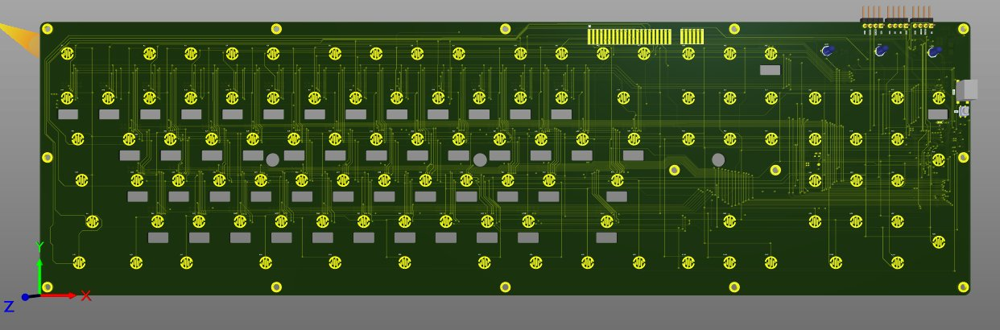

# ⌨️ OLED Linguistic Keyboard — 36-Language Dynamic Key Display

> **Per-Key OLED Screens · SPI Daisy-Chain · 36 Language Support · Real-Time Character Switching · Embedded Control · Full Keyboard Matrix**

---

## 📸 PCB

| 3D Render |
|-----------|
|  |

---

## 🎯 Overview

A fully custom keyboard where **every key has its own OLED display**. When the user selects a language from a supported set of **36 languages**, the character label on each key updates in real time to reflect the correct script — switching between Latin, Devanagari, Arabic, Cyrillic, CJK, and other writing systems instantly without physical keycap replacement.

Designed for multilingual embedded control applications, input terminals, and language-learning devices where physical keycap legends are a fundamental limitation. The board replaces static printed keycaps with a dynamically programmable display layer, making the keyboard hardware-agnostic to any script or symbol set supported in firmware.

---

## 🔧 How It Works

### Per-Key OLED Display
Each key position on the board carries a **small OLED display module** mounted on the circular pad footprint visible in the PCB layout. The OLED renders the character assigned to that key in the currently active language. When the language is changed:
1. The microcontroller sends a new character map to the SPI bus
2. Each OLED receives its updated glyph data via its chip-select line
3. All keys update their display — the entire keyboard relabels itself in under one frame

### SPI Daisy-Chain Architecture
The OLED displays are arranged in a **SPI daisy-chain topology** — the MOSI/CLK/CS lines run horizontally across the board, connecting each OLED in sequence. This approach:
- Minimises GPIO requirements on the controller (shared MOSI/CLK, individual CS per key or grouped CS per row)
- Allows the full keyboard to be updated with a single SPI burst
- Reduces routing complexity versus a parallel bus across 100+ displays

### Key Matrix
Below each OLED, a **SMD tactile switch** registers the physical keypress. The switches are wired in a standard **row × column matrix**, with the microcontroller scanning the matrix to detect which key is pressed. The pressed key's position is decoded, mapped to the active language character, and sent as a HID keycode to the host.

### Language Switching
A dedicated **language selection input** (physical key, rotary encoder, or host command) triggers a firmware routine that:
- Loads the glyph table for the selected language from flash memory
- Iterates through each key position
- Transmits the corresponding Unicode glyph bitmap to each OLED via SPI
- Updates the internal keycode map so subsequent keypresses report the correct character

**36 supported languages** — covering major world scripts including but not limited to: English, Hindi (Devanagari), Arabic, Russian (Cyrillic), Chinese, Japanese, Korean, Greek, Hebrew, Tamil, Telugu, Thai, and more.

---

## 📐 PCB Design Details

| Feature | Detail |
|---------|--------|
| Board | Long rectangular, full keyboard form factor |
| OLED count | ~100 keys (one OLED per key) |
| OLED interface | SPI (daisy-chain, shared MOSI/CLK) |
| Switch type | SMD tactile (rectangular pad, one per key) |
| Key matrix | Row × column scan |
| Host connector | FPC/ribbon + pin header (top edge) |
| Power supply | Pin header (top-right, +VCC / GND / SPI lines) |
| Soldermask | Green |
| Design tool | KiCad |

---

## 🌍 Supported Languages (36)

The firmware glyph table supports 36 languages spanning multiple Unicode blocks:

| Script Family | Languages |
|--------------|-----------|
| Latin | English, French, German, Spanish, Portuguese, Italian, Dutch, Polish, Czech, Romanian, Turkish, Vietnamese |
| Devanagari | Hindi, Marathi, Sanskrit, Nepali |
| Cyrillic | Russian, Ukrainian, Bulgarian, Serbian |
| Arabic | Arabic, Urdu, Persian/Farsi |
| CJK | Chinese (Simplified), Chinese (Traditional), Japanese (Hiragana/Katakana) |
| Other | Korean (Hangul), Greek, Hebrew, Tamil, Telugu, Kannada, Bengali, Thai, Gujarati |

---

## 🔧 Key Design Challenges

**Routing 100+ SPI displays on one board:**
The SPI daisy-chain runs horizontally across all key rows. Careful routing ensures signal integrity across the entire chain — series resistors on CLK and MOSI prevent reflections, and decoupling capacitors at each OLED's VCC pin suppress switching noise from adjacent displays updating simultaneously.

**Glyph rendering for complex scripts:**
Right-to-left scripts (Arabic, Hebrew, Urdu) and scripts with complex joining rules (Arabic ligatures, Devanagari conjuncts) require the firmware to pre-render glyphs as bitmaps before transmission to the OLED. A font rendering layer in firmware converts Unicode code points to 1-bit bitmaps sized for the OLED resolution.

**Power budget across 100 OLEDs:**
Each OLED draws current during pixel updates. The power supply is sized for worst-case simultaneous update of all displays. Bulk capacitance on the board absorbs the transient current surge during a full-keyboard language switch.

**Key matrix ghosting prevention:**
Diodes in the key matrix prevent ghosting — ensuring simultaneous multi-key presses (modifier + character keys) are accurately decoded without phantom key events.

---

## 🗂️ Files

- `assets/pcb_3d.png` — PCB render (3D, KiCad) — OLED pads, switch matrix, SPI routing, FPC connector, and pin headers visible
