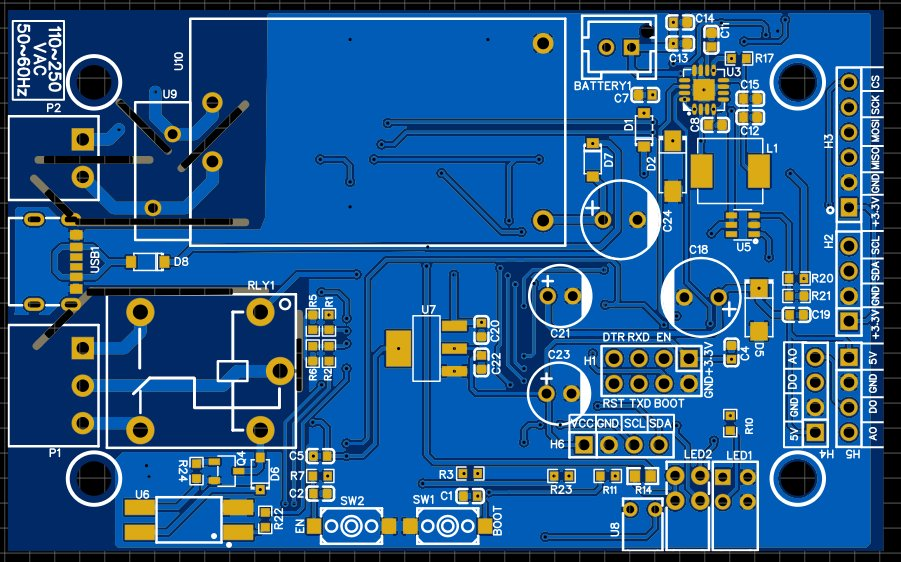
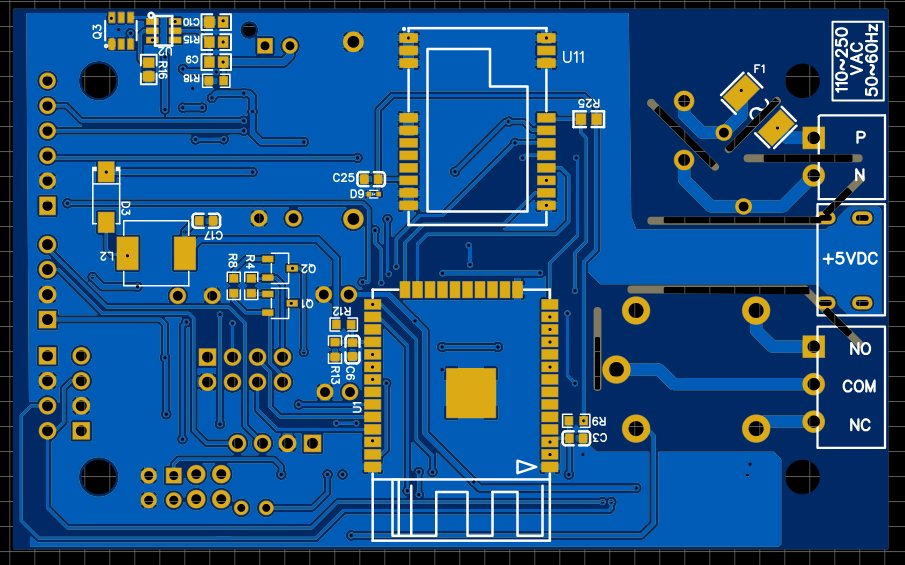
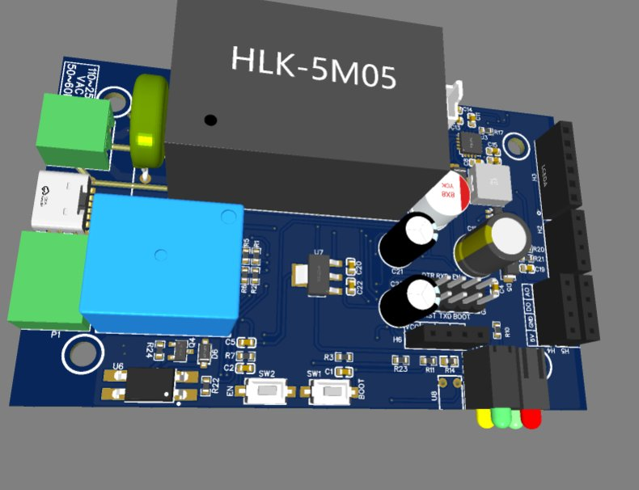
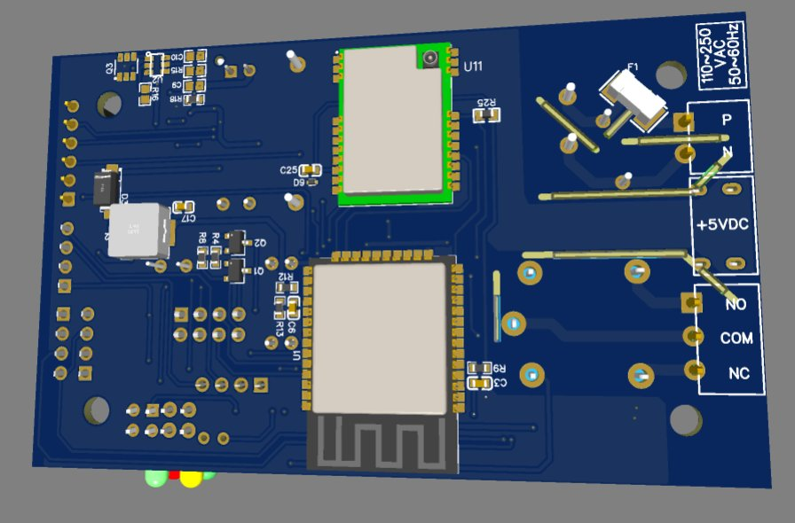

# 📡 LoRa IoT Smart Switch — WiFi + LoRa 900MHz + AC Relay + Battery

> **ESP32 · E22-900M22S LoRa SX1262 · AC 110–250V Relay (SPDT) · HLK-5M05 · TP5100 Li-Ion BMS · DW01A Protection · MT3608 Boost · I2C/SPI/Analog Expansion · OLED Header · 3-Sheet Design**

---

## 📸 PCB

| Top Layer (2D) | Bottom Layer (2D) |
|---|---|
|  |  |

| Top (3D) | Bottom (3D) |
|---|---|
|  |  |

---

## 🎯 Overview

A dual-radio IoT smart switch capable of controlling AC mains loads (110–250V) remotely over both **WiFi (MQTT/HTTP)** and **LoRa 900MHz long-range radio**. The board is designed for deployment in areas with unreliable WiFi coverage — LoRa provides a fallback long-range link (up to several kilometres line-of-sight) to a gateway. A **Li-ion battery with full BMS** keeps the node alive during power outages. Sensor expansion headers (I2C, SPI, Analog, OLED) allow the same board to serve as a sensor hub in addition to a switch controller — temperature, humidity, soil, or any other sensor can be attached without hardware modification.

---

## 🔧 Architecture

```
AC Mains (110–250V)
        │
        ├──► HLK-5M05 ──► +5V (MAIN_5V) ──► AMS1117 ──► +3.3V
        │         │
        │    USB-C ──► +5V (alternate input)
        │
        └──► Relay (SRD-05VDC, SPDT) ──► AC Load (NO/COM/NC)
                  ▲
           PC817 Opto + FMMT620 NPN ◄── ESP32 GPIO (RELAY signal)

Li-Ion Battery ◄──► TP5100 Charger (from MAIN_5V)
       │
  DW01A + FS8205 (protection)
       │
  MT3608 Boost ──► MAIN_5V (battery backup)

ESP-32S
  ├── WiFi ──► MQTT / HTTP (cloud / local)
  ├── SPI ──► E22-900M22S LoRa 900MHz ──► Long-range gateway
  ├── I2C ──► H2 sensor header / H6 OLED header
  ├── SPI ──► H3 sensor header
  ├── ADC ──► H4/H5 analog sensor headers
  ├── ADC ──► BATT% divider (30k/100k)
  └── GPIO ──► RELAY, LED indicators, EN/BOOT
```

---

## 🔧 Block-by-Block Description

### Block 1 — ESP32 Controller (Sheet 1, U1)
The **ESP-32S** handles all application logic — WiFi connectivity, LoRa SPI management, relay control, sensor polling, and battery monitoring:

- **RELAY GPIO** — drives the optocoupler-isolated relay circuit to switch AC loads
- **LoRa SPI bus** — NSS/SCK/MOSI/MISO to the E22-900M22S, plus IO1 (DIO1 interrupt), BSY (busy flag), N_RESET
- **I2C bus** (SDA/SCL) — shared between H2 sensor header and H6 OLED display header
- **BATT%** — ADC input from 30kΩ/100kΩ voltage divider (R12/R13) on BAT+ for real-time battery percentage reporting via MQTT
- **AO/DO** — analog and digital outputs to H4/H5 sensor connectors (MAIN_5V powered)
- **WIFI-LED** — dual-colour LED (MHK2396GEBTD) with 470Ω resistors (R10/R11): PWR + WiFi status
- **Auto-reset** — SS8050-G NPN pair (Q1/Q2) for DTR/RST-based bootloader entry via H1 programming header
- **EN/BOOT buttons** (SW1/SW2) — K2-1107ST with 470Ω series (R3/R7) and 1nF debounce (C1/C2/C3)
- **10k pull-ups** (R4/R8/R9) on EN and GPIO0 for clean boot state

**Expansion Headers:**
| Header | Interface | Signals |
|--------|-----------|---------|
| H1 | Programming | CS/MOSI/SCK/MISO/DTR/RST/GND/+3.3V |
| H2 | I2C Sensor | +3.3V/GND/SDA/SCL |
| H3 | SPI Sensor | +3.3V/GND/MISO/MOSI/SCK/CS |
| H4/H5 | Analog Sensor | MAIN_5V/GND/AO/DO |
| H6 | I2C OLED | +3.3V/GND/SCL/SDA |

### Block 2 — LoRa Module: E22-900M22S (Sheet 2, U11)
The **E22-900M22S** integrates a Semtech SX1262 LoRa transceiver operating at **900MHz** for long-range, low-power wireless communication:
- **SPI interface** (NSS/SCK/MOSI/MISO) to ESP32 — carries LoRa packet TX/RX
- **DIO1** — interrupt output to ESP32 IO1 — signals RX-done, TX-done, CRC error events
- **BUSY** — indicates module is processing; ESP32 polls before SPI transactions
- **NRST** — hardware reset from ESP32 N_RESET GPIO
- **100kΩ pull-up (R25)** on NSS — ensures CS is deasserted during power-up
- **100nF decoupling (C25)** on VCC + **ESD9B3.3ST5G TVS (D9)** on antenna/RF line — protects against ESD on the antenna connector
- Operates at +3.3V; supports LoRaWAN or point-to-point protocols in firmware

### Block 3 — Battery Management System (Sheet 2)

**TP5100 Charger (U3):**
- Charges Li-ion battery from MAIN_5V supply
- **22µH inductor (L1)** + **SS34 Schottky (D2)** switching node
- **50mΩ sense resistor (R17)** — sets and monitors charge current
- **100nF + 10µF** decoupling on VIN and BAT pins
- CHRG#/STDBY# outputs drive **LED2 (MHK2396YGBTD)** for charge status indication
- BAT output to **B02B-XASK-1-A** battery JST connector

**DW01A + FS8205 Protection (U2/Q3):**
- **DW01A** — dedicated Li-ion protection IC monitoring OD (over-discharge), OC (over-charge), CS (current sense)
- **FS8205** — dual N-channel MOSFET acting as the protection switch in the battery path
- **100Ω (R15)** gate resistor, 100nF (C9/C11) decoupling — clean switching without oscillation
- **0Ω link (R18)** — allows bypassing the protection circuit during testing

**MT3608 Boost: BAT+ → MAIN_5V (U5):**
- When AC mains is absent, the battery boost takes over — maintaining MAIN_5V for the ESP32, relay, and sensors
- **22µH (L2)** + **SS34 (D3)** + **22µF output caps (C17/C19)** + **680µF bulk (C18)** — heavy bulk capacitance absorbs relay coil switching transients
- **14.7kΩ/2kΩ feedback (R20/R21)** — sets MAIN_5V output precisely
- **MBR120LSF (D1)** — Schottky ORing diode between HLK output and battery boost output — seamless source handoff

### Block 4 — AC Power Supply (Sheet 3)

**HLK-5M05 (U10):**
- Isolated AC-DC module accepting **110–250V AC, 50–60Hz**
- Outputs clean +5V DC (MAIN_5V) — the primary system power source
- **MF2410F1.000TM fuse (F1)** — 1A AC-side overcurrent protection
- **FTR14D391K varistor (U9)** — MOV surge protection on AC input against mains spikes and lightning transients
- **100µF (C24)** bulk capacitor on +5V output
- **WJ15EDGRC-3.81-2P (P2)** — AC mains input terminal block

**AMS1117-3.3 (U7):**
- MAIN_5V → **+3.3V** linear regulator for ESP32 and all logic
- **10µF (C20/C22)** + **47µF (C21/C23)** — combined 114µF output capacitance for stability and transient response
- Feeds all 3.3V headers and the E22 LoRa module

**USB-C Input (USB1, U262-061N-4BVC11):**
- Alternative 5V input when AC mains is not available
- **MBR120LSF (D8)** — Schottky on VBUS → MAIN_5V, preventing backfeed to USB host

### Block 5 — Relay Circuit (Sheet 3)

**PC817X3CSP9F Optocoupler (U6):**
- Galvanically isolates ESP32 RELAY GPIO (3.3V logic) from the relay coil drive circuit
- **1kΩ resistors (R23/R24)** limit LED current through the optocoupler

**FMMT620TA NPN Transistor (Q4):**
- Driven by optocoupler output — switches the **SRD-05VDC-SL-C relay (RLY1)** coil
- **330Ω (R22)** base resistor limits drive current
- **D6 flyback diode** across relay coil — suppresses the inductive spike when coil de-energises
- Red **LED (U8)** — relay energised indicator

**SRD-05VDC-SL-C Relay (RLY1):**
- SPDT relay with **NO, COM, NC** contacts
- Rated for AC mains switching — controls the external AC load
- Output on **WJ15EDGRC-3.81-3P (P1)** 3-pin terminal block (NO/COM/NC)

---

## 📐 Key Specifications

| Parameter | Value |
|-----------|-------|
| MCU | ESP-32S (WiFi 802.11 b/g/n + BLE) |
| Long-Range Radio | E22-900M22S (LoRa SX1262, 900MHz) |
| AC Input | 110–250V AC, 50–60Hz |
| AC Protection | MOV varistor + 1A fuse |
| AC-DC Converter | HLK-5M05 (isolated, +5V) |
| Relay | SRD-05VDC SPDT (NO/COM/NC) |
| Relay Isolation | PC817 optocoupler + FMMT620 NPN |
| Logic Supply | AMS1117-3.3 (5V→3.3V) |
| Battery | Li-ion (B02B-XASK JST connector) |
| Charger | TP5100 (MAIN_5V input, 50mΩ CS) |
| Battery Protection | DW01A + FS8205 dual MOSFET |
| Battery Boost | MT3608 (BAT+→MAIN_5V, 22µH) |
| Battery Monitor | 30k/100k ADC divider → ESP32 |
| USB-C Input | U262-061N-4BVC11 (5V alternate) |
| Sensor Headers | I2C × 2, SPI × 1, Analog × 2, OLED × 1 |

---

## 🧩 Key Components

| Reference | Part | Function |
|-----------|------|----------|
| U1 | ESP-32S | WiFi + BLE MCU — relay, LoRa, sensors |
| U11 | E22-900M22S | LoRa SX1262 900MHz transceiver |
| U10 | HLK-5M05 | Isolated AC 110–250V → 5V |
| U7 | AMS1117-3.3 | 5V → 3.3V LDO |
| RLY1 | SRD-05VDC-SL-C | SPDT relay (AC load switching) |
| U6 | PC817X3CSP9F | Optocoupler (relay isolation) |
| Q4 | FMMT620TA | NPN relay driver |
| U3 | TP5100 | Li-ion battery charger |
| U2 | DW01A | Li-ion protection IC |
| Q3 | FS8205 | Dual MOSFET (battery protection) |
| U5 | MT3608 | BAT+→MAIN_5V boost converter |
| D1, D7, D8 | MBR120LSF | Schottky ORing diodes |
| U9 | FTR14D391K | MOV varistor (AC surge protection) |
| F1 | MF2410F1.000TM | 1A AC fuse |
| D9 | ESD9B3.3ST5G | LoRa antenna ESD TVS |
| Q1, Q2 | SS8050-G | Auto-reset NPN pair |
| USB1 | U262-061N-4BVC11 | USB-C 5V input |
| P1 | WJ15EDGRC-3.81-3P | Relay output (NO/COM/NC) |
| P2 | WJ15EDGRC-3.81-2P | AC mains input terminal |

---

## 🗂️ Files

- `assets/pcb_2d_top.png` — Top layer PCB layout (ESP32, relay, power)
- `assets/pcb_2d_bottom.png` — Bottom layer PCB layout (LoRa module, ESP32 bottom, AC section)
- `assets/pcb_3d_top.png` — 3D render top (HLK-5M05, relay, USB-C, headers, LEDs)
- `assets/pcb_3d_bottom.png` — 3D render bottom (E22 LoRa, ESP32 module, boost converter)
- `assets/schematic.pdf` — Full 3-sheet schematic (EasyEDA)
